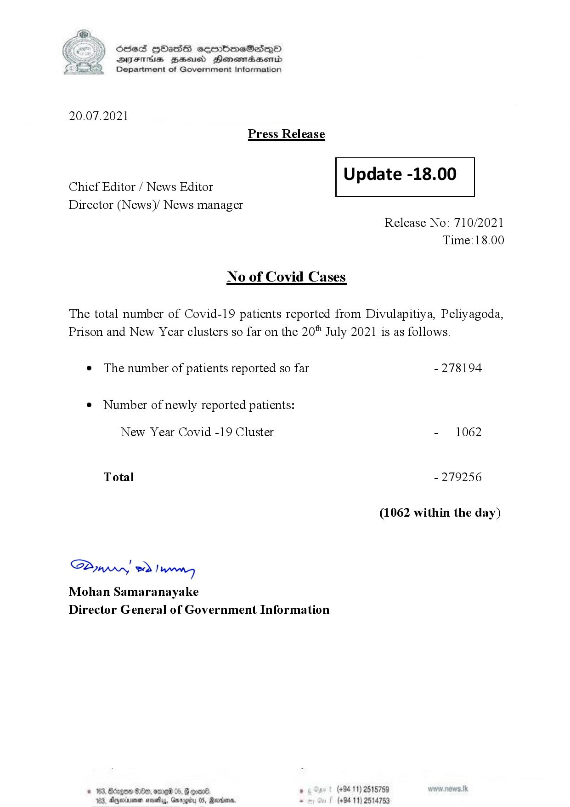

# Press Release - 2021.07.20 
Key: 8fe61068b72bfe4a825b469e83e514a3 

---
```
S) ScseS HOasdS cerrbmeSdQo
DFTs BHEosd Henewtaeasernid
Department of Government Information

 

20.07.2021
Press Release

 

Update -18.00

 

 

Chief Editor / News Editor
Director (News)/ News manager

 

Release No: 710/2021
Time: 18.00

No of Covid Cases

The total number of Covid-19 patients reported from Divulapitiya, Peliyagoda,
Prison and New Year clusters so far on the 20" July 2021 is as follows.

¢ The number of patients reported so far - 278194

¢ Number of newly reported patients:

New Year Covid -19 Cluster - 1062
Total - 279256
(1062 within the day)

Sw 2) wn
Mohan Samaranayake
Director General of Government Information

© 163, Bdogon $00, ome 0 p. . (+9411) 2515759
103, Agere nays, Garey 05, Rardin . (+94 11) 2514753

 
 

```
