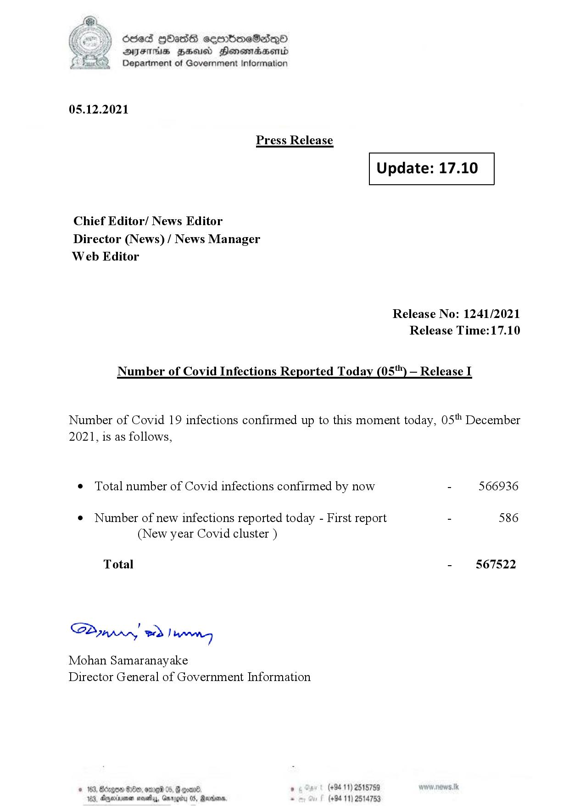

# Press Release - 2021.12.05 
Key: 9008796eb9f00378ae27a464317c719e 

---
```
(oe) Sed QOass cerrbroeSadqQo
DFS HHS Honsmnadaerntd
Department of Government Information

 

05.12.2021

Press Release

 

Update: 17.10

 

 

 

Chief Editor/ News Editor
Director (News) / News Manager
Web Editor

Release No: 1241/2021
Release Time:17.10

Number of Covid Infections Reported Today (05'") — Release I

Number of Covid 19 infections confirmed up to this moment today, 05" December

2021, is as follows,

¢ Total number of Covid infections confirmed by now - 566936

¢ Number of new infections reported today - First report - 586
(New year Covid cluster )

-  §67522

Total

Sa mprn! wd! wong

Mohan Samaranayake
Director General of Government Information

 
 

© 163, Bago G00, ore 05, # one , (+94 11) 2515789
183, Dryerinemen sovethys, Ga . (+94 11) 25

  

05, Rearions,

```
