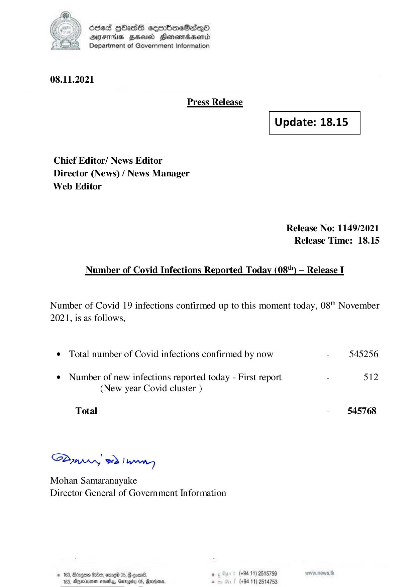

# Press Release - 2021.11.08 
Key: 90174cc911b27580ef67586e9ce181a7 

---
```
) dcded QOadS seenBboeSiqQo
AIFS HHUCO Honemadaenrd
Department of Government Information

 

08.11.2021

Press Release

 

 

Update: 18.15

 

 

Chief Editor/ News Editor
Director (News) / News Manager
Web Editor

Release No: 1149/2021
Release Time: 18.15

Number of Covid Infections Reported Today (08") — Release I

Number of Covid 19 infections confirmed up to this moment today, 08" November
2021, is as follows,

e Total number of Covid infections confirmed by now - 545256

¢ Number of new infections reported today - First report - 512
(New year Covid cluster )

Total - 545768

SPynpry wd! hawny

Mohan Samaranayake
Director General of Government Information

 

© 163, Bdzgoe $10, ome 05, @ gomn® , (+94 11) 2518759
163. Agywinmen sess, Gnroerty 05, arbors. . (+94 11) 2514753

```
