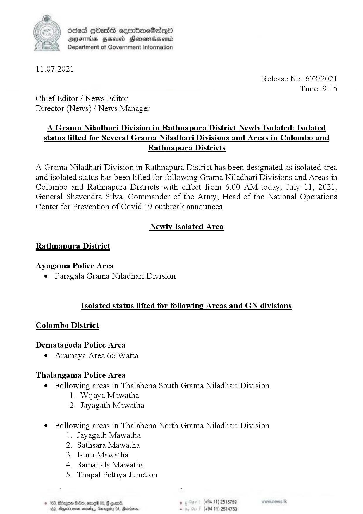

# Press Release - 2021.07.11 - Newly Isolated Areas & Isolated status lifted Areas 
Key: 9032e5e6a7de19359980c22eff7e5819 

---
```
fie) Oded gOas eeembreSadqQod
‘ DAFT HSU Honowadaenrd
Department of Government Information

 

11.07.2021
Release No: 673/2021
Time: 9:15
Chief Editor / News Editor
Director (News) / News Manager

A Grama Niladhari Division in Rathnapura District Newly Isolated: Isolated
status lifted for Several Grama Niladhari Divisions and Areas in Colombo and

Rathnapura Districts

A Grama Niladhari Division in Rathnapura District has been designated as isolated area
and isolated status has been lifted for following Grama Niladhari Divisions and Areas in
Colombo and Rathnapura Districts with effect from 6.00 AM today, July 11, 2021,
General Shavendra Silva, Commander of the Army, Head of the National Operations
Center for Prevention of Covid 19 outbreak announces.

Newly Isolated Area

Rathnapura District

Ayagama Police Area
e Paragala Grama Niladhari Division

Isolated status lifted for following Areas and GN divisions
Colombo District

Dematagoda Police Area
e Aramaya Area 66 Watta

Thalangama Police Area
¢ Following areas in Thalahena South Grama Niladhari Division
1. Wijaya Mawatha
2. Jayagath Mawatha

e Following areas in Thalahena North Grama Niladhari Division
1. Jayagath Mawatha

Sathsara Mawatha

Tsuru Mawatha

Samanala Mawatha

Thapal Pettiya Junction

OY oS eh

p (+94 11) 2518759
, Rear. 2 (+9411 53

  

© 163, Bdegos #80, ome 0
103, Anexiuenen navel, Gmroeit

 

```
