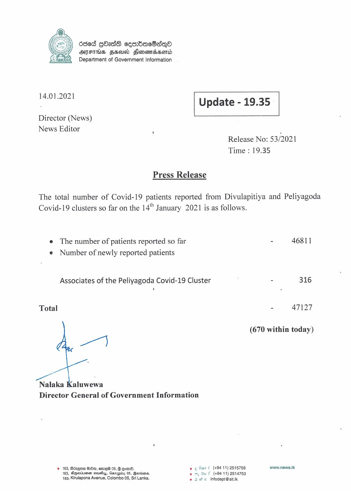

# Press Release - 2021.01.14 
Key: 91ed2838e381776b9ec209b305ede418 

---
```
  

6ded GO2dS sesrbacSaqQo
AIFS FEU Sonomsasonid
©) Department of Government Information

 

Leo Update - 19.35

 

 

 

Director (News)

News Editor :
Release No: 53/2021
Time : 19.35

Press Release

The total number of Covid-19 patients reported from Divulapitiya and Peliyagoda
Covid-19 clusters so far on the 14" January 2021 is as follows.

e The number of patients reported so far - 46811
e Number of newly reported patients

Associates of the Peliyagoda Covid-19 Cluster - 316

Total - 47127

(670 within today)

ot

Nalaka Kaluwewa
Director General of Government Information

© 163, Bézqoa OOo, emme® 05, § Eom. ec Osrt (+94 11) 2515759 www.news.|k
163, SGeviumen sacy, Gswpby 05, Boorins. uf (+9411) 2514753
163, Kirulapona Avenue, Colombo 05, Sri Lanka. © g We infodept@sit.k

 

```
