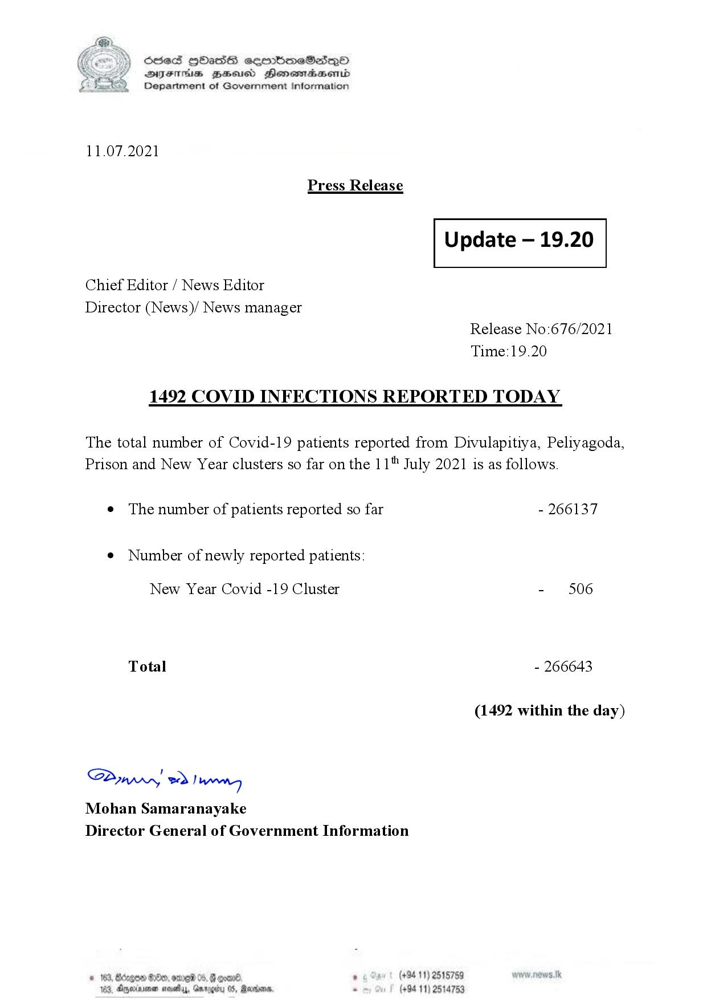

# Press Release - 2021.07.11 - Covid 19 infection report 
Key: 9267c81ceccb83fd1894fd825e201232 

---
```
(6 S) ScseS HOasdS cerrbmeSdQo
DFTs BHEosd Henewtaeasernid
Department of Government Information

 

11.07.2021

Press Release

 

Update — 19.20

 

 

 

Chief Editor / News Editor

Director (News)/ News manager
Release No:676/2021

Time:19.20
1492 COVID INFECTIONS REPORTED TODAY

The total number of Covid-19 patients reported from Divulapitiya, Peliyagoda,
Prison and New Year clusters so far on the 11" July 2021 is as follows.

e The number of patients reported so far - 266137

¢ Number of newly reported patients:

New Year Covid -19 Cluster - 506
Total - 266643
(1492 within the day)

Saw 2) won,
Mohan Samaranayake
Director General of Government Information

© 163, Bdegon G80, ome 0 6 ’ (+94 11) 2515759
163, Agere naethy, Gmrogiby 05, Rereisons, - (+94 11) 2514753

 

```
