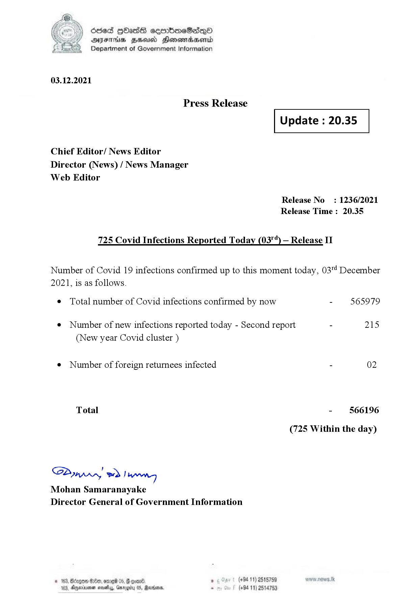

# Press Release - 2021.12.03 
Key: 93520f6ba63ba0cbcee3e3aca3f5b8a1 

---
```
dosed GOass eemmbmeSadepO
DFS BHU Honswnradasentd
Department of Government Information

 

 

03.12.2021

Press Release

Chief Editor/ News Editor
Director (News) / News Manager
Web Editor

 

 

Update : 20.35

 

 

Release No

: 1236/2021

Release Time : 20.35

725 Covid Infections Reported Today (03") — Release II

Number of Covid 19 infections confirmed up to this moment today, 03"! December

2021, is as follows.

¢ Total number of Covid infections confirmed by now

¢ Number of new infections reported today - Second report

(New year Covid cluster )

¢ Number of foreign returnees infected

Total

SP nprrn wd Ianwng
Mohan Samaranayake
Director General of Government Information

GOD 100, omg 05
Doyerinsonen snevetyy, Garo

   

(+94 11) 2515759
(+94 11) 2514753

565979

215

02

566196

(725 Within the day)

```
