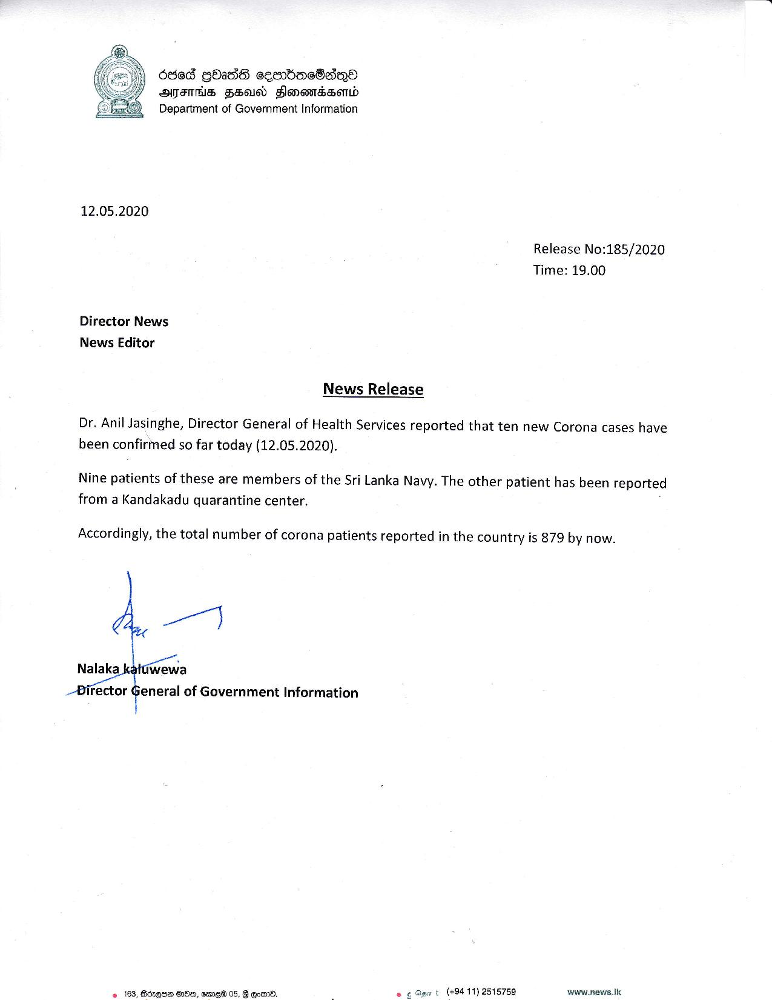

# Press Release - 2020.05.12 - 10 new corona cases have been confirmed today 
Key: 9381e7b4ee9d953d5defc772f3bb4b9a 

---
```
deed GbasS cembdac8aqno
OMFS Head Honemdbsentd
Department of Government Information

 

12.05.2020

Release No:185/2020
Time: 19.00

Director News
News Editor

News Release

Dr. Anil Jasinghe, Director General of Health Services reported that ten new Corona cases have
been confirmed so far today (12.05.2020).

Nine patients of these are members of the Sri Lanka Navy. The other patient has been reported
from a Kandakadu quarantine center.

Accordingly, the total number of corona patients reported in the country is 879 by now.

 

```
