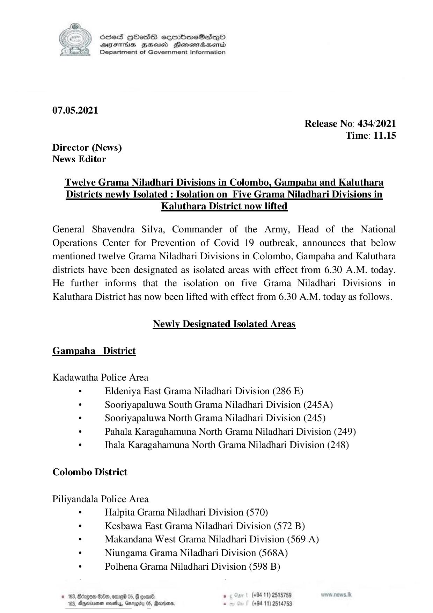

# Press Release - 2021.05.07 - Twelve Grama Niladhari Divisions in Colombo ,Gampaha and Kaluthara Districts newly isolated : Isolation on Five Grama Niladhari Divisions in Kaluthara Districts now lifted 
Key: 93d797a13abdbeecf46864d5a7ded0e1 

---
```
S865 HOasS eqrmbmeSs—oO
DFTs BHousd Henombaend
Department of Government Information

 

07.05.2021

Release No: 434/2021
Time: 11.15
Director (News)
News Editor

Twelve Grama Niladhari Divisions in Colombo, Gampaha and Kaluthara
Districts newly Isolated : Isolation on Five Grama Niladhari Divisions in
Kaluthara District now lifted

General Shavendra Silva, Commander of the Army, Head of the National
Operations Center for Prevention of Covid 19 outbreak, announces that below
mentioned twelve Grama Niladhari Divisions in Colombo, Gampaha and Kaluthara
districts have been designated as isolated areas with effect from 6.30 A.M. today.
He further informs that the isolation on five Grama Niladhari Divisions in
Kaluthara District has now been lifted with effect from 6.30 A.M. today as follows.

Newly Designated Isolated Areas

Gampaha_District

Kadawatha Police Area
. Eldeniya East Grama Niladhari Division (286 E)
: Sooriyapaluwa South Grama Niladhari Division (245A)
. Sooriyapaluwa North Grama Niladhari Division (245)
. Pahala Karagahamuna North Grama Niladhari Division (249)
. Thala Karagahamuna North Grama Niladhari Division (248)

Colombo District

Piliyandala Police Area
. Halpita Grama Niladhari Division (570)
. Kesbawa East Grama Niladhari Division (572 B)
. Makandana West Grama Niladhari Division (569 A)
. Niungama Grama Niladhari Division (568A)
. Polhena Grama Niladhari Division (598 B)

. (+94 11) 2515789
(+94 11) 2514753

 

```
