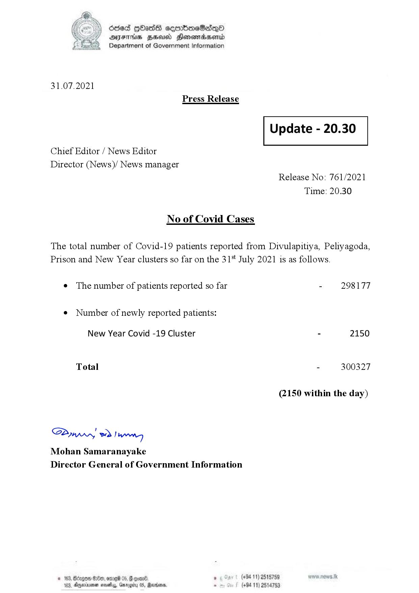

# Press Release - 2021.07.31 
Key: 93ff392f7756b7ecb55fa9683bb75c55 

---
```
6ed HOass semrboeSadqoO
OFTHIS BHU Honowradserd
Department of Government Information

 

31.07.2021
Press Release

 

Update - 20.30

 

 

 

Chief Editor / News Editor
Director (News)/ News manager
Release No: 761/2021

Time: 20.30

No of Covid Cases

The total number of Covid-19 patients reported from Divulapitiya, Peliyagoda,
Prison and New Year clusters so far on the 31% July 2021 is as follows.

e The number of patients reported so far - 298177

¢ Number of newly reported patients:

New Year Covid -19 Cluster - 2150
Total - 300327
(2150 within the day)

SPywwwy > Ian
Mohan Samaranayake
Director General of Government Information

© 163, Bérges en, erred 05, 6 ° (+94 11) 2518759
183, Dyeriiunen novelas, Gmrogicy 05, Rerrons, . (+94 11) 2514753

```
