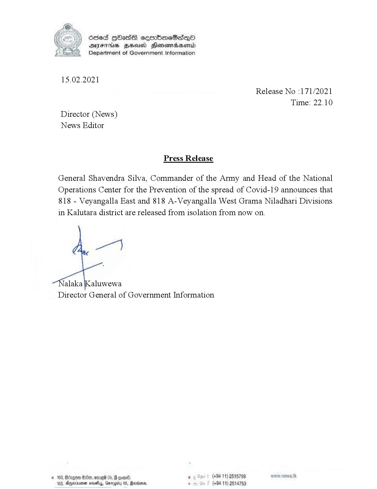

# Press Release - 2021.02.15 - Released from Isolation 
Key: 9470d04b0ccc34403bfe61b7030efce0 

---
```
Ose 9Hass cermmboeSesqQO
AIFS BSAC Honowaasentd
Department of Government Information

 

15.02.2021

Release No :171/2021
Time: 22.10
Director (News)
News Editor

Press Release

General Shavendra Silva, Commander of the Army and Head of the National
Operations Center for the Prevention of the spread of Covid-19 announces that
818 - Veyangalla East and 818 A-Veyangalla West Grama Niladhari Divisions
in Kalutara district are released from isolation from now on.

Za)

alaka Kaluwewa
Director General of Government Information

 

© 163, Borgen G00, omreid 05,  ooar® , (+94 11) 2515759
103, Ayminmen nowy, Garogitu 05, Marden, . (+94 11) 2514753

```
