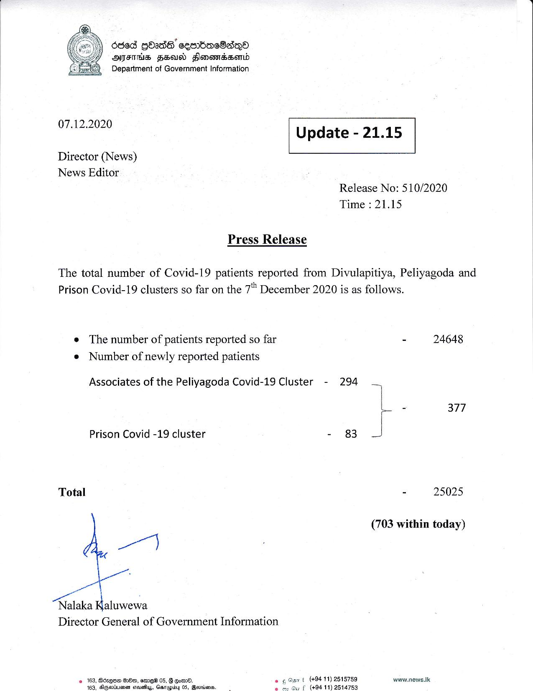

# Press Release - 2020.12.07 
Key: 9605e665b8d7dfcd00c98c7388d39338 

---
```
Oded gbadS’ sembaeSan®
MAIFIHS HBAS Slomerndsord
©) Department of Government Information

  

 

07.12.2020

 

Director (News)

Update - 21.15

 

 

News Editor

Release No: 510/2020
Time : 21.15

Press Release

The total number of Covid-19 patients reported from Divulapitiya, Peliyagoda and
Prison Covid-19 clusters so far on the 7" December 2020 is as follows.

e The number of patients reported so far
e Number of newly reported patients

Associates of the Peliyagoda Covid-19 Cluster - 294
Prison Covid -19 cluster - 83
Total
Pe
Nalaka Kaluwewa
Director General of Government Information
© 163, Bdzgee Sle, emEW 05, F oe. (+94 11) 2515759

 

163, Aipertiienen cteueflyy, Gasrapiby 05, Geordies, r (494 11) 2514753

- 24648

son 377

- 25025

(703 within today)

www.news.Ik.

 

```
