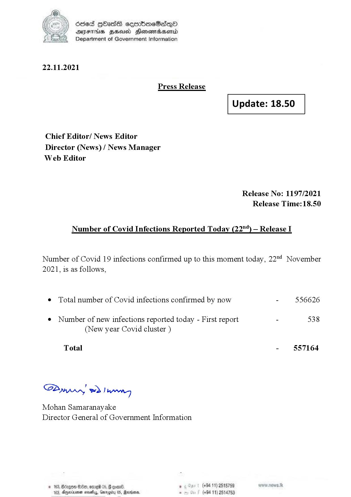

# Press Release - 2021.11.22 
Key: 9650ac1c118f031c4ff8e9a68e933183 

---
```
(oe) Sed QOass cerrbroeSadqQo
DFS HHS Honsmnadaerntd
Department of Government Information

 

22.11.2021

Press Release

 

Update: 18.50

 

 

 

Chief Editor/ News Editor
Director (News) / News Manager
Web Editor

Release No: 1197/2021
Release Time: 18.50

Number of Covid Infections Reported Today (22"*) — Release I

Number of Covid 19 infections confirmed up to this moment today, 22"! November

2021, is as follows,

¢ Total number of Covid infections confirmed by now - 556626

¢ Number of new infections reported today - First report - 538
(New year Covid cluster )

-  §57164

Total

Sa mprn! wd! wong

Mohan Samaranayake
Director General of Government Information

(+94 11) 2515789
(+84 11) 25

 
 

© 163, Bdegow Oe, ome 05, @ goav8, ,
05, Rearions,

163, jeriivenen waits, Gr

  

```
