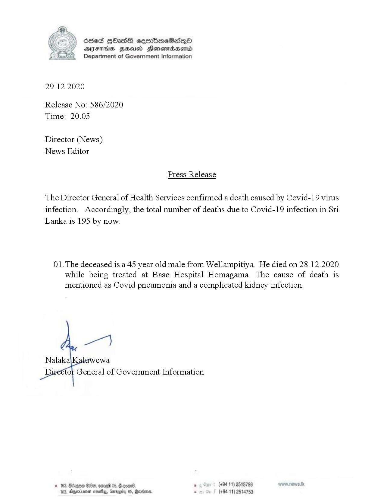

# Press Release - 2020.12.29 - Covid 19 infection deaths rises to 195 
Key: 96a2d623d34257f284358ad89aeb9a3d 

---
```
Sded HHasGs sermbmeSadq®
AFIS ZHU Honemiadaentd
Department of Government Information

 

29.12.2020

Release No: 586/2020
Time: 20.05

Director (News)
News Editor

Press Release

The Director General of Health Services confirmed a death caused by Covid-19 virus
infection. Accordingly, the total number of deaths due to Covid-19 infection in Sri
Lanka is 195 by now.

01.The deceased is a 45 year old male from Wellampitiya. He died on 28.12.2020
while being treated at Base Hospital Homagama. The cause of death is
mentioned as Covid pneumonia and a complicated kidney infection.

   

tor General of Government Information

© 163, Bdcgon HOe, ome 05, GF coal. , (+94 11) 2515759
103, Anexnena noes, Gary , Bevo, . (+84 11) 2514753

  

```
