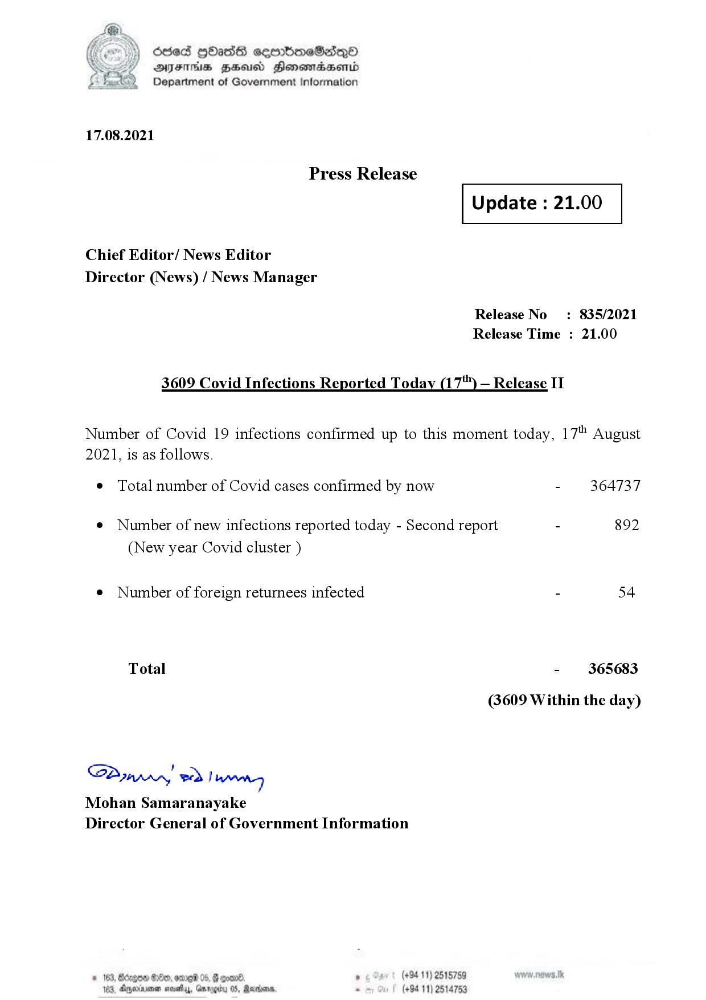

# Press Release - 2021.08.17 - Covid 19 Infection Report 
Key: 96b7267e82d8fc0889cecc1f807753b8 

---
```
dosed GOass eemmbmeSadepO
DFS BHU Honswnradasentd
Department of Government Information

 

 

17.08.2021

Press Release

Chief Editor/ News Editor
Director (News) / News Manager

 

 

Update : 21.00

 

 

Release No: 835/2021
Release Time : 21.00

3609 Covid Infections Reported Today (17) — Release II

Number of Covid 19 infections confirmed up to this moment today, 17" August

2021, is as follows.

¢ Total number of Covid cases confirmed by now

¢ Number of new infections reported today - Second report

(New year Covid cluster )

¢ Number of foreign returnees infected

Total

SB eed Rename
Mohan Samaranayake
Director General of Government Information

© 163, Bcegoe Ge, ome 065, & come
188, gerinjenen moseay, Garg

 

. (+94 11) 2515759
(+94 11) 2514753

- 364737

892

- 365683
(3609 Within the day)

```
