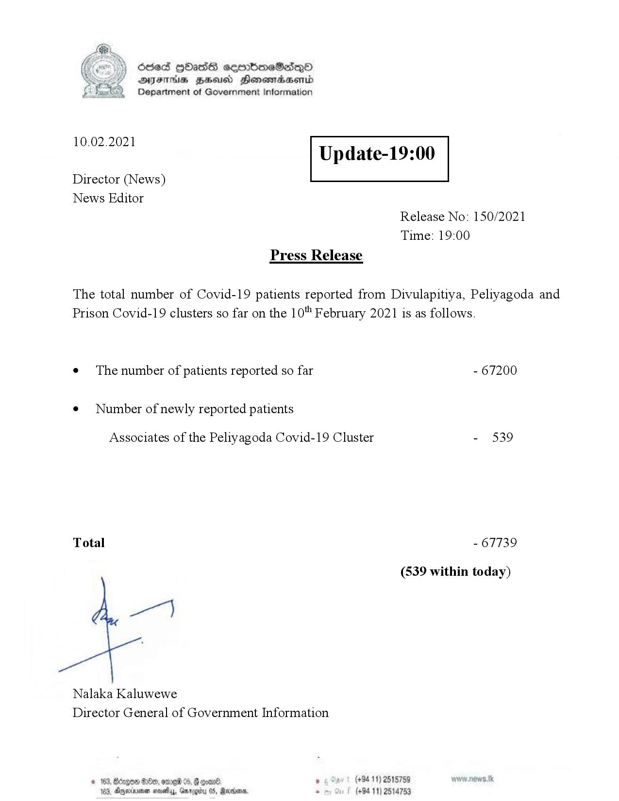

# Press Release - 2021.02.10 
Key: 96fc5cc009958e5e8227ba6be2e0d425 

---
```
Ssed HbasG sembmeSadqo
DAIS BHU Honomasentd
Department of Government Information

 

 

10.02.2021

Update-19:00

 

 

 

Director (News)
News Editor
Release No: 150/2021
Time: 19:00
Press Release

The total number of Covid-19 patients reported from Divulapitiya, Peliyagoda and
Prison Covid-19 clusters so far on the 10" February 2021 is as follows.
e¢ The number of patients reported so far - 67200

¢ Number of newly reported patients

Associates of the Peliyagoda Covid-19 Cluster - 539

Total - 67739

(539 within today)

Nalaka Kaluwewe
Director General of Government Information

© 162, Bccge0 @8e0, ere 05, @ erene ‘ (+94 11) 2515759
183, Agere savy, Gxrogity 05, Rarwanw, - (+94 11) 2514753

```
