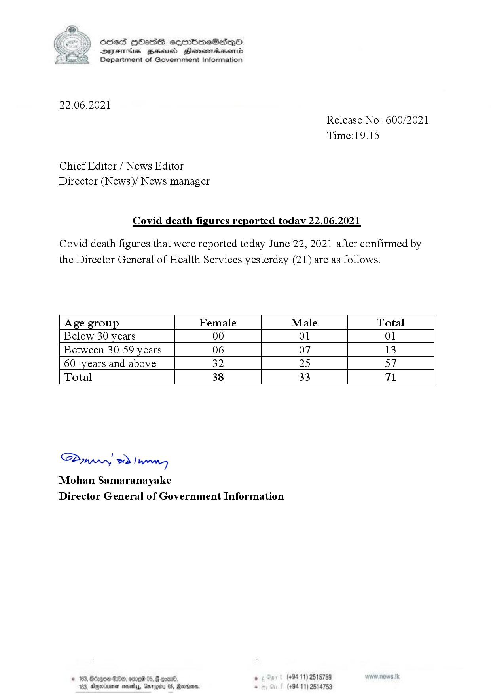

# Press Release - 2021.06.22- Covid 19 infection deaths 
Key: 9764010c5a8194f9f164aa0a73fb7e97 

---
```
) SieS HOadS cemmbmeSedqQo
DFTs BHEosd Henewtaeasernid
Department of Government Information

 

22.06.2021
Release No: 600/2021
Time:19.15

Chief Editor / News Editor
Director (News)/ News manager

Covid death figures reported today 22.06.2021

Covid death figures that were reported today June 22, 2021 after confirmed by
the Director General of Health Services yesterday (21) are as follows.

 

 

 

 

 

Age group Female Male Total
Below 30 years 00 01 01
Between 30-59 years 06 07 13
60 years and above 32 25 57
Total 38 33 71

 

 

 

 

 

 

SP od Ianwng
Mohan Samaranayake
Director General of Government Information

NED 0 06) . (+94 11) 2515759
44, Gargtty 05, Martone, . (+94 11) 2514753

   

3, Agerniean s

```
