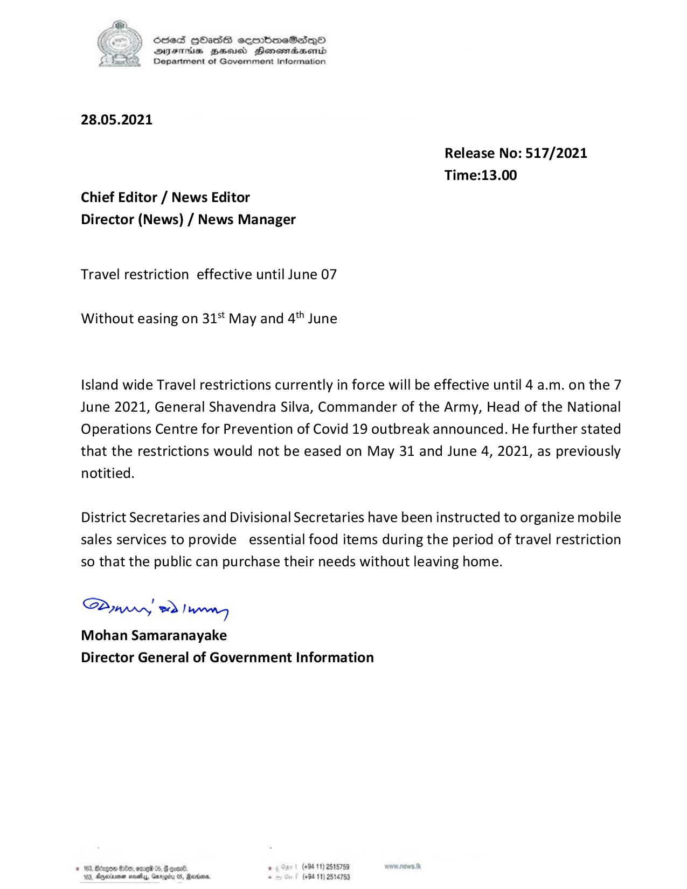

# Press Release - 2021.05.28 - Travel Restriction effective until June 07 
Key: 97b459700e8275eafe254b14a5731d7b 

---
```
SSeS HOISS ecmbmoeG@sqQo
Syste Bees Henomadacmbd
Department of Government Information

 

28.05.2021

Release No: 517/2021
Time:13.00

Chief Editor / News Editor

Director (News) / News Manager

Travel restriction effective until June 07

Without easing on 31 May and 4" June

Island wide Travel restrictions currently in force will be effective until 4 a.m. on the 7
June 2021, General Shavendra Silva, Commander of the Army, Head of the National
Operations Centre for Prevention of Covid 19 outbreak announced. He further stated
that the restrictions would not be eased on May 31 and June 4, 2021, as previously
notitied.

District Secretaries and Divisional Secretaries have been instructed to organize mobile
sales services to provide essential food items during the period of travel restriction
so that the public can purchase their needs without leaving home.

SPywwwy > Ing
Mohan Samaranayake
Director General of Government Information

+94 11) 2515789
(+94 11) 2514753

 

```
