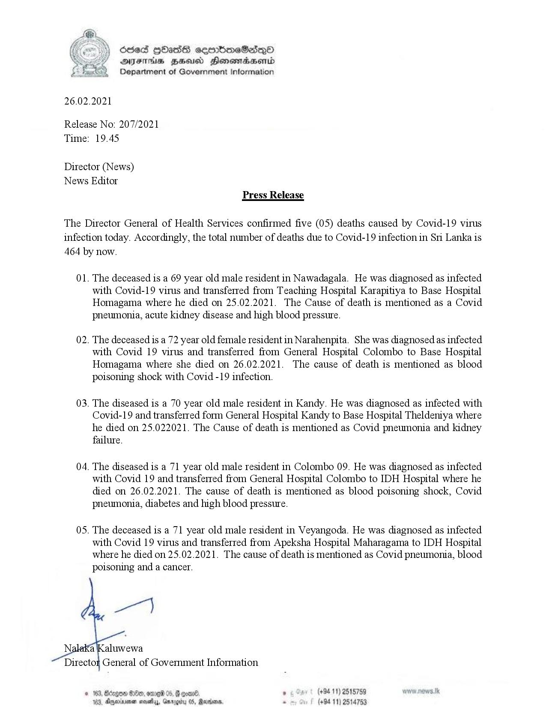

# Press Release - 2021.02.26 - Covid 19 infection deaths 
Key: 97d4d4758f4a70fd740a9534fc6fd911 

---
```
 

26.02.

68ed HOass semimeSadqoO
AIFS BHU Honswmiadsertd
Department of Government Information

.2021

Release No: 207/2021

Time:

19.45

Director (News)

News

Editor
Press Release

The Director General of Health Services confirmed five (05) deaths caused by Covid-19 virus
infection today. Accordingly, the total number of deaths due to Covid-19 infection in Sri Lanka is
464 by now.

01.

02.

03.

04.

0S.

   

The deceased is a 69 year old male resident in Nawadagala. He was diagnosed as infected
with Covid-19 virus and transferred from Teaching Hospital Karapitiya to Base Hospital
Homagama where he died on 25.02.2021. The Cause of death is mentioned as a Covid
pneumonia, acute kidney disease and high blood pressure.

The deceased is a 72 year old female resident in Narahenpita. She was diagnosed as infected
with Covid 19 virus and transferred from General Hospital Colombo to Base Hospital
Homagama where she died on 26.02.2021. The cause of death is mentioned as blood
poisoning shock with Covid -19 infection.

The diseased is a 70 year old male resident in Kandy. He was diagnosed as infected with
Covid-19 and transferred form General Hospital Kandy to Base Hospital Theldeniya where
he died on 25.022021. The Cause of death is mentioned as Covid pneumonia and kidney
failure.

The diseased is a 71 year old male resident in Colombo 09. He was diagnosed as infected
with Covid 19 and transferred from General Hospital Colombo to IDH Hospital where he
died on 26.02.2021. The cause of death is mentioned as blood poisoning shock, Covid
pneumonia, diabetes and high blood pressure.

The deceased is a 71 year old male resident in Veyangoda. He was diagnosed as infected
with Covid 19 virus and transferred from Apeksha Hospital Maharagama to IDH Hospital
where he died on 25.02.2021. The cause of death is mentioned as Covid pneumonia, blood
poisoning and a cancer.

Directof General of Government Information

163, Bérgoe Oe, ome 05, 8 oan ° (494-11) 2515759 ws.Ik
163, Dgyerinenen noietlys, Gmrogity 08, Raurtom, s (+94 11) 2514753

```
