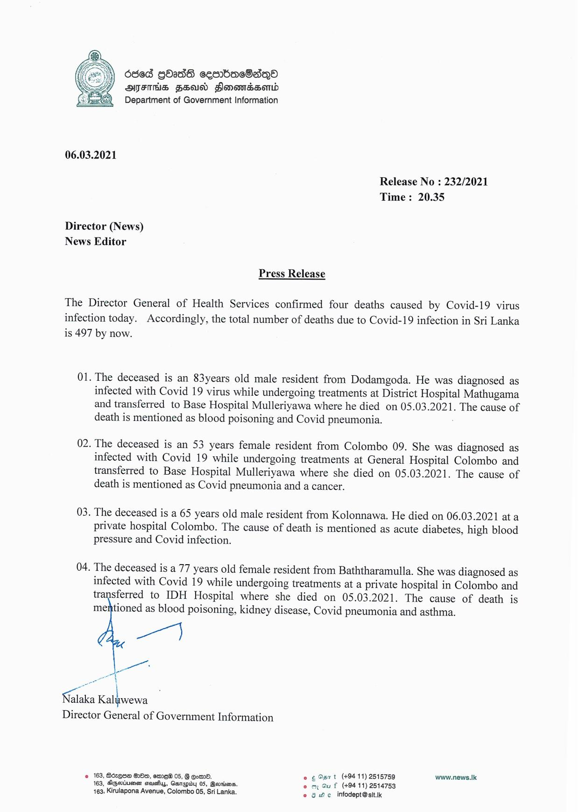

# Press Release - 2021.03.06 - Covid 19 infection deaths 
Key: 9829d316572a1d44874435cc89bd5ac9 

---
```
6865 GOadd cesrbac8aqQe
SFIS FED Sonondssemd
Department of Government Information

 

06.03.2021

Release No : 232/2021
Time : 20.35

Director (News)
News Editor

Press Release

The Director General of Health Services confirmed four deaths caused by Covid-19 virus
infection today. Accordingly, the total number of deaths due to Covid-19 infection in Sri Lanka
is 497 by now.

01. The deceased is an 83years old male resident from Dodamgoda. He was diagnosed as
infected with Covid 19 virus while undergoing treatments at District Hospital Mathugama
and transferred to Base Hospital Mulleriyawa where he died on 05.03.2021. The cause of
death is mentioned as blood poisoning and Covid pneumonia.

02. The deceased is an 53 years female resident from Colombo 09. She was diagnosed as
infected with Covid 19 while undergoing treatments at General Hospital Colombo and
transferred to Base Hospital Mulleriyawa where she died on 05.03.2021. The cause of
death is mentioned as Covid pneumonia and a cancer.

03. The deceased is a 65 years old male resident from Kolonnawa. He died on 06.03.2021 ata
private hospital Colombo. The cause of death is mentioned as acute diabetes, high blood
pressure and Covid infection.

04. The deceased is a 77 years old female resident from Baththaramulla. She was diagnosed as
infected with Covid 19 while undergoing treatments at a private hospital in Colombo and
transferred to IDH Hospital where she died on 05.03.2021. The cause of death is
mentioned as blood poisoning, kidney disease, Covid pneumonia and asthma.

ae)

ao

\
Nalaka Ealpoews
Director General of Government Information

© 163, Bozque Oe, eme® 05, § em. © ¢ Oar t (+9411) 2515759 www.news..k:
163, Sgevineen seuafiys, Ganepiby 05, Beordiens. © mm Gu f (+9411) 2514753
163, Kirulapona Avenue, Colombo 05, Sri Lanka. © 8 We infodept@sit.k

```
