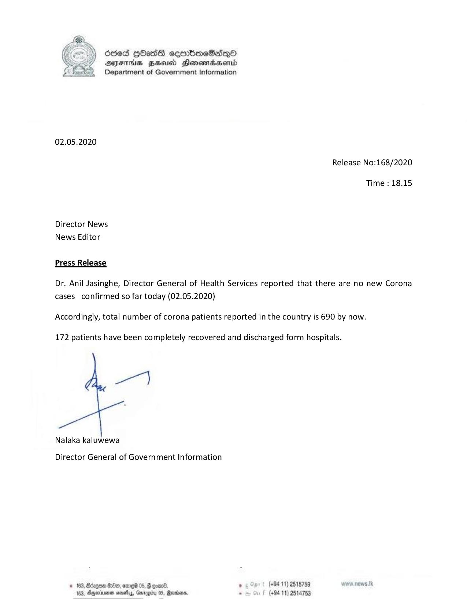

# Press Release - 2020.05.02- Total number of corona patients reported in the country is 690 by now 
Key: 989acce814c4e87dc62631f27b7a0414 

---
```
Oecd 9Hass cemmbmeS2sqQo
DFIHS BHU Honewmadsertd
Department of Government Information

 

02.05.2020
Release No:168/2020

Time : 18.15

Director News
News Editor

Press Release

Dr. Anil Jasinghe, Director General of Health Services reported that there are no new Corona
cases confirmed so far today (02.05.2020)

Accordingly, total number of corona patients reported in the country is 690 by now.

172 patients have been completely recovered and discharged form hospitals.

pe)

Nalaka kaluwewa

Director General of Government Information

 

© 163, Bdrgon Ge, ome 05, F com . pr (494.11) 2518789
104, Dryerinenen moiety, Garogity 05, Reunions, s (+94 11) 2514753

```
