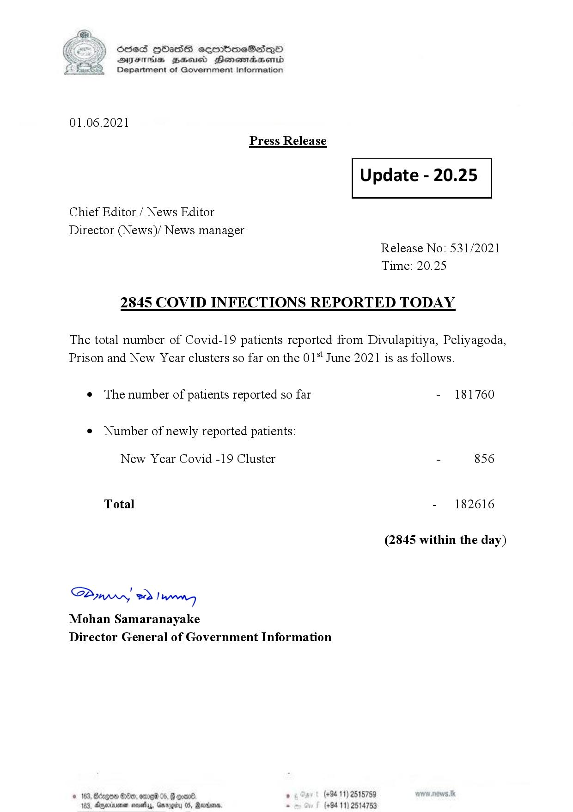

# Press Release - 2021.06.01 - Covid 19 infection report 
Key: 98cccce687cce5821f6ecaf600b62c05 

---
```
(6 S) ScseS HOasdS cerrbmeSdQo
DFTs BHEosd Henewtaeasernid
Department of Government Information

 

01.06.2021
Press Release

Chief Editor / News Editor
Director (News)/ News manager

 

 

Update - 20.25

 

 

Release No: 531/2021
Time: 20.25

2845 COVID INFECTIONS REPORTED TODAY

The total number of Covid-19 patients reported from Divulapitiya, Peliyagoda,
Prison and New Year clusters so far on the 01 June 2021 is as follows.

e The number of patients reported so far

¢ Number of newly reported patients:

New Year Covid -19 Cluster

Total

Saw 2) won,
Mohan Samaranayake
Director General of Government Information

© 163, ong

 

- 181760

- 856

- 182616

(2845 within the day)

00, ome 05, § qoar® , (+94 11) 2515759

103, Ageinvemen wos, Garg 05, Randers. . (+94 11) 2514753

```
