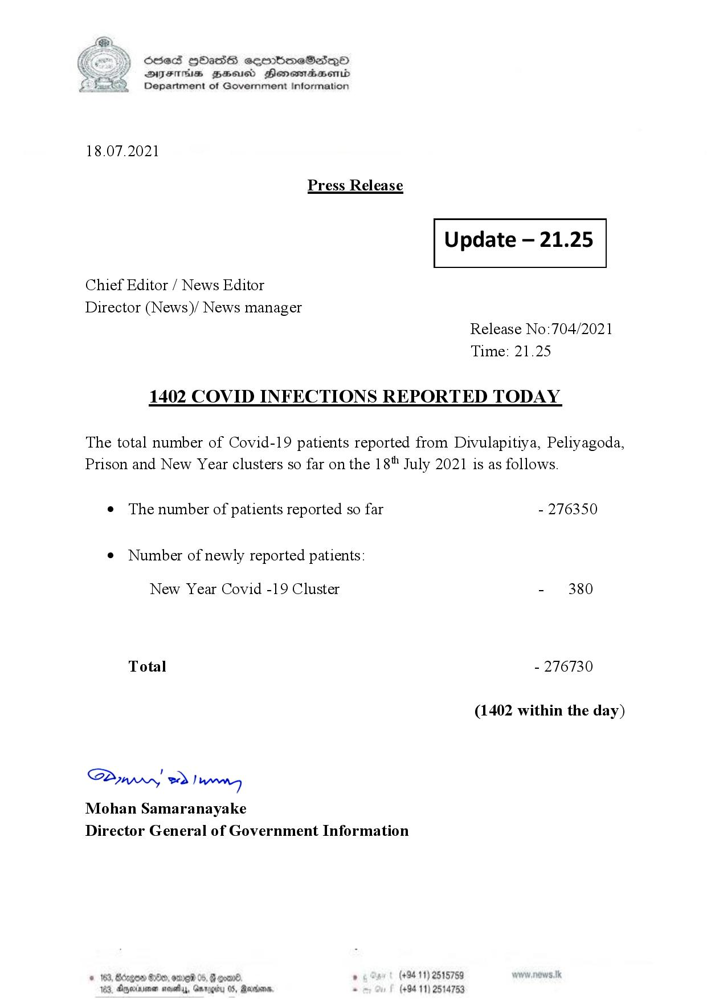

# Press Release - 2021.07.18 - Covid 19 infection report 
Key: 9908007823eaf53ba8027acecce83ab8 

---
```
(6 S) ScseS HOasdS cerrbmeSdQo
DFTs BHEosd Henewtaeasernid
Department of Government Information

 

18.07.2021

Press Release

 

Update — 21.25

 

 

 

Chief Editor / News Editor

Director (News)/ News manager
Release No:704/2021

Time: 21.25
1402 COVID INFECTIONS REPORTED TODAY

The total number of Covid-19 patients reported from Divulapitiya, Peliyagoda,
Prison and New Year clusters so far on the 18" July 2021 is as follows.

e The number of patients reported so far - 276350

¢ Number of newly reported patients:

New Year Covid -19 Cluster - 380
Total - 276730
(1402 within the day)

Saw 2) won,
Mohan Samaranayake
Director General of Government Information

© 163, Bdegon G80, ome 0 6 ’ (+94 11) 2515759
163, Agere naethy, Gmrogiby 05, Rereisons, - (+94 11) 2514753

 

```
