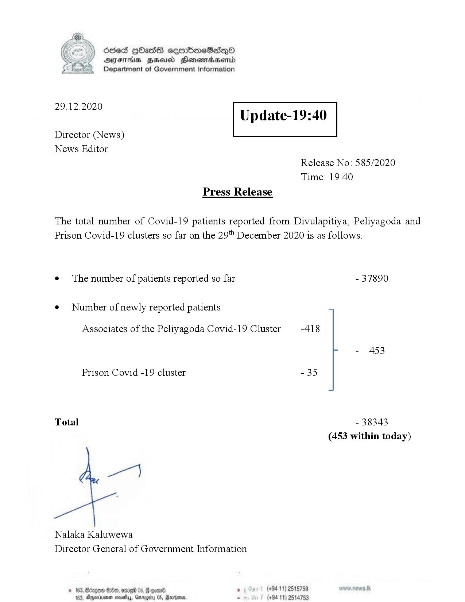

# Press Release - 2020.12.29 
Key: 9a0200e4e8136efa93f7c2dabd15b0e8 

---
```
Ssed HbasG sembmeSadqo
DAIS BHU Honomasentd
Department of Government Information

 

 

29.12.2020

Update-19:40

 

 

 

Director (News)
News Editor
Release No: 585/2020
Time: 19:40
Press Release

The total number of Covid-19 patients reported from Divulapitiya, Peliyagoda and
Prison Covid-19 clusters so far on the 29" December 2020 is as follows.

e¢ The number of patients reported so far - 37890

¢ Number of newly reported patients
Associates of the Peliyagoda Covid-19 Cluster -418
- 453

Prison Covid -19 cluster -35

Total - 38343
(453 within today)

Nalaka Kaluwewa
Director General of Government Information

© 163, Borges Ge, ome 05, G goa , (+94 11) 2515759
103, Agere nests, Garogity 0S, Rarens, . (+94 11) 2514759

```
