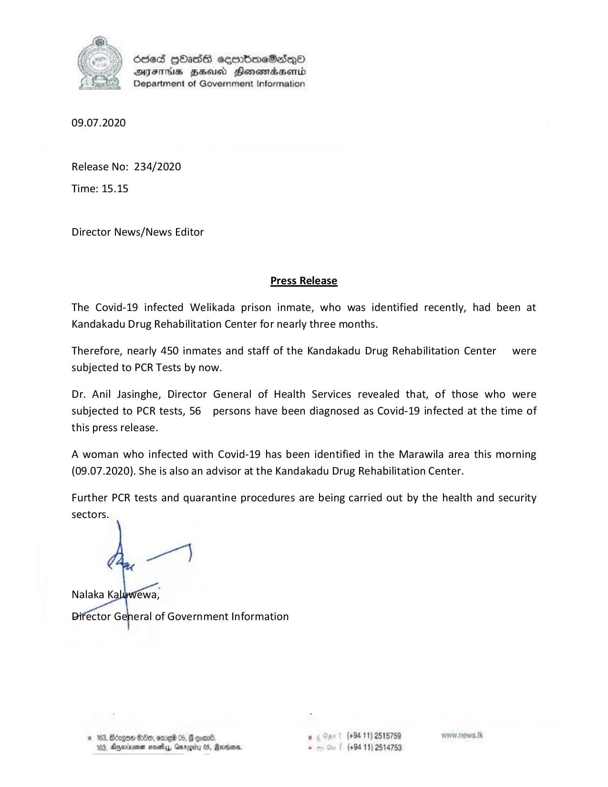

# Press Release - 2020.07.09 - 56 Person have been diagnosed as covid 19 infected at Kandakadu Drug Rehabilitation Center 
Key: 9a66aa0c6d43f4be02b5d204fca3c68c 

---
```
6ced gHass sembmeSesq_Qo0
AIFS BHU Honswmiadsertd
Department of Government Information

 

09.07.2020

Release No: 234/2020
Time: 15.15

Director News/News Editor

Press Release

The Covid-19 infected Welikada prison inmate, who was identified recently, had been at
Kandakadu Drug Rehabilitation Center for nearly three months.

Therefore, nearly 450 inmates and staff of the Kandakadu Drug Rehabilitation Center were
subjected to PCR Tests by now.

Dr. Anil Jasinghe, Director General of Health Services revealed that, of those who were
subjected to PCR tests, 56 persons have been diagnosed as Covid-19 infected at the time of
this press release.

A woman who infected with Covid-19 has been identified in the Marawila area this morning
(09.07.2020). She is also an advisor at the Kandakadu Drug Rehabilitation Center.

Further PCR tests and quarantine procedures are being carried out by the health and security
sectors.

    

Nalaka Ki éwa,

eral of Government Information

© 163, Bdogoe G0, ome 05, G qoand. . (+94 11) 2515789 www nows.Ik
183, Aerie sas, Gnrogiy 05, Rares - (+94 11) 2514753

```
