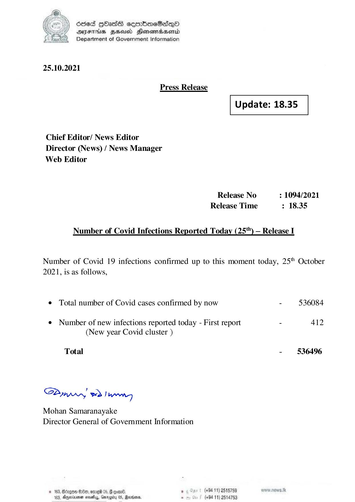

# Press Release - 2021.10.25 
Key: 9b22866272abdd52352581bf02ebd054 

---
```
) dcded QOadS seenBboeSiqQo
AIFS HHUCO Honemadaenrd
Department of Government Information

 

25.10.2021

Press Release

 

 

Update: 18.35

 

 

Chief Editor/ News Editor
Director (News) / News Manager
Web Editor

Release No : 1094/2021
Release Time : 18.35

Number of Covid Infections Reported Today (25) — Release I

Number of Covid 19 infections confirmed up to this moment today, 25" October
2021, is as follows,

e Total number of Covid cases confirmed by now - 536084

¢ Number of new infections reported today - First report - 412
(New year Covid cluster )

Total - 536496

SPynpry wd! hawny

Mohan Samaranayake
Director General of Government Information

 

© 163, Bdzgoe $10, ome 05, @ gomn® , (+94 11) 2518759
163. Agywinmen sess, Gnroerty 05, arbors. . (+94 11) 2514753

```
