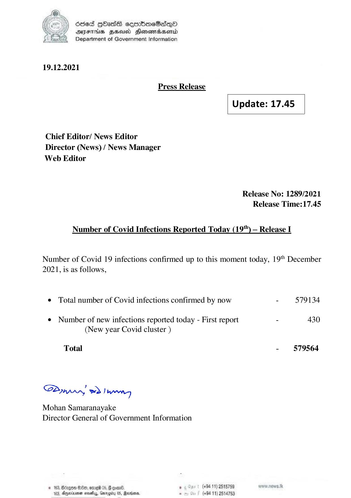

# Press Release - 2021.12.19 
Key: 9b43090c1ff891bc2350304cf6570bf4 

---
```
) dcded QhasS ceerbneSdiqQo
DFTs HH Honsomadsenid
Department of Government Information

 

 

19.12.2021
Press Release
Update: 17.45
Chief Editor/ News Editor
Director (News) / News Manager
Web Editor

Release No: 1289/2021
Release Time:17.45

Number of Covid Infections Reported Today (19") — Release I

Number of Covid 19 infections confirmed up to this moment today, 19" December
2021, is as follows,

© Total number of Covid infections confirmed by now - 579134

¢ Number of new infections reported today - First report - 430
(New year Covid cluster )

- 579564

Total

Sa mprr wd! bong

Mohan Samaranayake
Director General of Government Information

(+94 11) 2515759
(+94 11) 2514753

 

© 163, Bdzgon Oe, ore 05, B coal.
163, Apexnener sevethys, Garogiry 0S, Rare,

```
