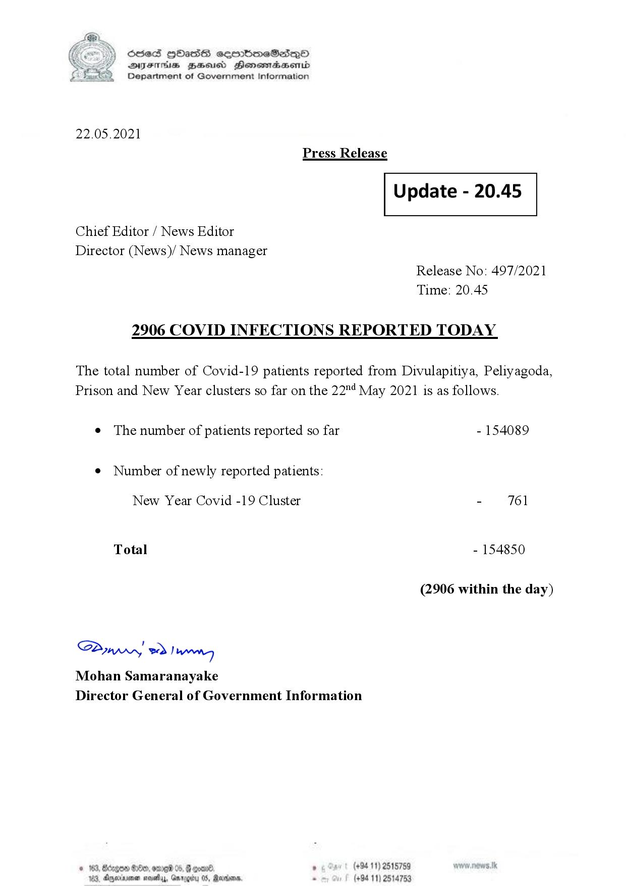

# Press Release - 2021.05.22 - Covid 19 Infection report 
Key: 9b8846fd46c38aa62249241b6b1524c5 

---
```
(6 S) ScseS HOasdS cerrbmeSdQo
DFTs BHEosd Henewtaeasernid
Department of Government Information

 

22.05.2021
Press Release

 

Update - 20.45

 

 

 

Chief Editor / News Editor
Director (News)/ News manager
Release No: 497/2021
Time: 20.45
2906 COVID INFECTIONS REPORTED TODAY

The total number of Covid-19 patients reported from Divulapitiya, Peliyagoda,
Prison and New Year clusters so far on the 22"! May 2021 is as follows.

e The number of patients reported so far - 154089

¢ Number of newly reported patients:

New Year Covid -19 Cluster - 761
Total - 154850
(2906 within the day)

Saw 2) won,
Mohan Samaranayake
Director General of Government Information

. (+94 11) 2515759
(+94 11) 2514753

 

```
