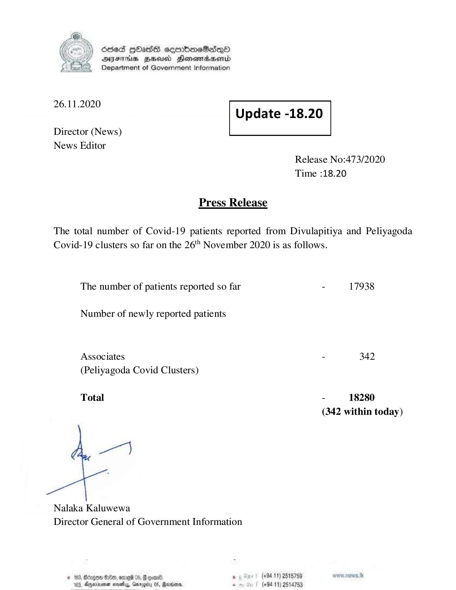

# Press Release - 2020.11.26 
Key: 9bfd5c3413d1a08463dae049ff29e76e 

---
```
6563 HOHasG sembmcSasqQo
DAJFITAs BHU Honomrdbsertd
Department of Government Information

 

 

 

 

 

26.11.2020
Update -18.20
Director (News)
News Editor
Release No:473/2020
Time :18.20

Press Release
The total number of Covid-19 patients reported from Divulapitiya and Peliyagoda
Covid-19 clusters so far on the 26" November 2020 is as follows.
The number of patients reported so far - 17938
Number of newly reported patients
Associates - 342
(Peliyagoda Covid Clusters)

Total - 18280
(342 within today)

7}

Nalaka Kaluwewa
Director General of Government Information

* 163, Bcogon Ge, ome %, G goad . (+94 11) 2515759 ww. news. tk
123, Oneiarnen sovaby, Grrogity 05, Madan. . (+9411) 2514753

```
