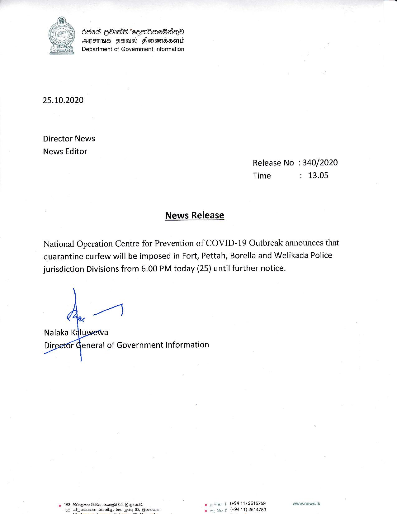

# Press Release - 2020.10.25 - Quarantine curfew will be imposed in Fort,Pettah,Borella and Welikada police jurisdiction Divisions 
Key: 9c153f27201d541d433267a1b1636ebf 

---
```
6868 GbadS ‘seenbacBasqQo
AFG FSU Slonovidssentd
Department of Government Information

 

25.10.2020

Director News

News Editor
Release No : 340/2020
Time > 13.05

News Release

National Operation Centre for Prevention of COVID-19 Outbreak announces that
quarantine curfew will be imposed in Fort, Pettah, Borella and Welikada Police
jurisdiction Divisions from 6.00 PM today (25) until further notice.

 
   

Nalaka Kalu
t General of Government Information

(+94 11) 2515759 www.news.lk
f (+94 11) 2514753

    

```
