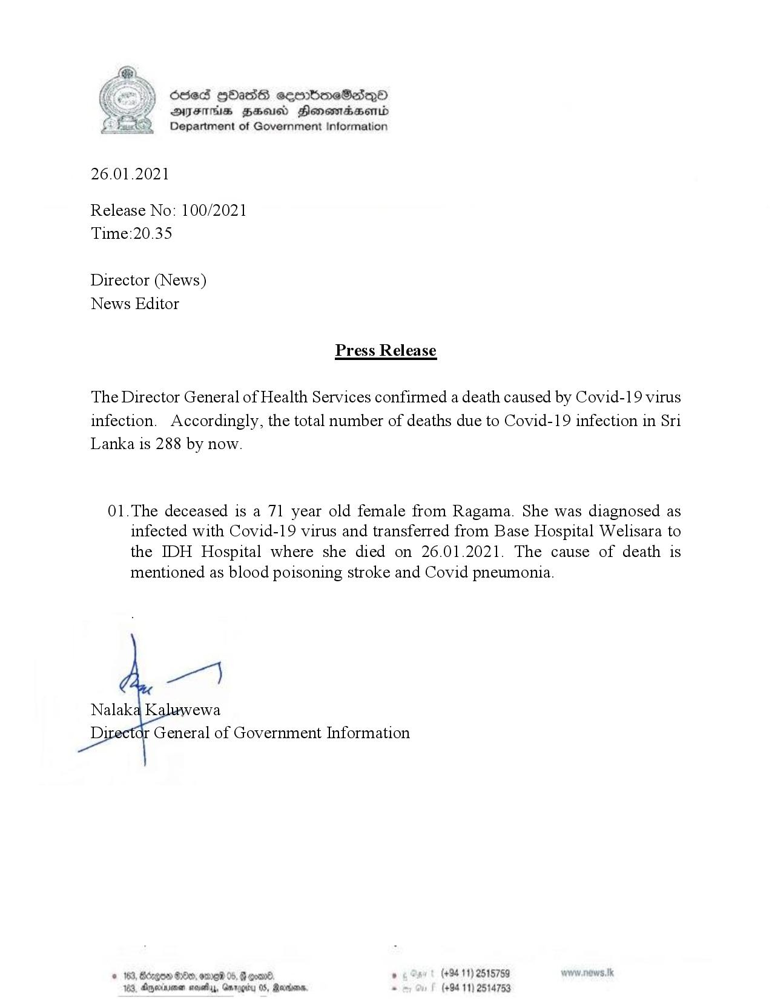

# Press Release - 2021.01.26 - A Covid infection death has been reported ,total deaths rises to 288 
Key: a0d808881068ba25361d955326c0eed7 

---
```
osed HOHass seembmeSadq0
AIFS HHA Honewiaaerid
Department of Government Information

 

26.01.2021

Release No: 100/2021
Time:20.35

Director (News)
News Editor

Press Release

The Director General of Health Services confirmed a death caused by Covid-19 virus
infection. Accordingly, the total number of deaths due to Covid-19 infection in Sri
Lanka is 288 by now.

01.The deceased is a 71 year old female from Ragama. She was diagnosed as
infected with Covid-19 virus and transferred from Base Hospital Welisara to
the IDH Hospital where she died on 26.01.2021. The cause of death is
mentioned as blood poisoning stroke and Covid pneumonia.

per)

Nalaka K ewa
Di General of Government Information

© 163, Bdegon Be, ore 05, B goad . (+94 11) 2515759
163, Agexrenen moves, Gmrggity 05, Ranionn, . (+84 11) 2514753

```
