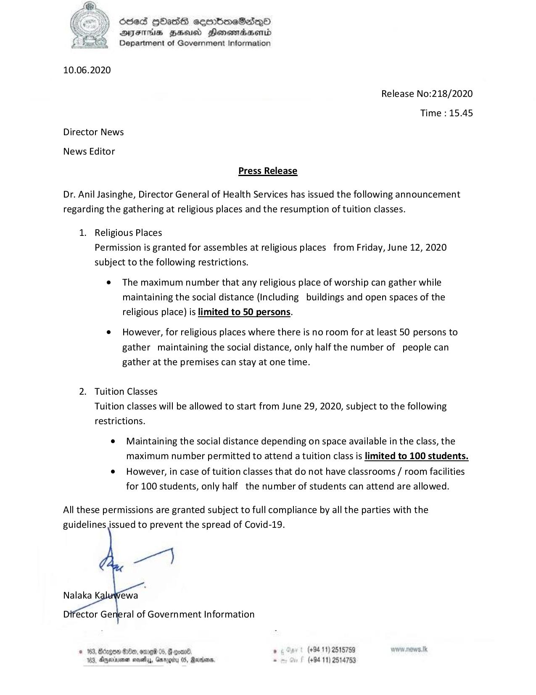

# Press Release - 2020.06.10 
Key: a1cc50632eba88e911fb02994c096fc8 

---
```
686d HHasG sembmeSaiqQo
AIFS BHU Honowmadasentd
Department of Government Information

 

10.06.2020

Release No:218/2020
Time : 15.45
Director News
News Editor

Press Release

Dr. Anil Jasinghe, Director General of Health Services has issued the following announcement
regarding the gathering at religious places and the resumption of tuition classes.

1. Religious Places
Permission is granted for assembles at religious places from Friday, June 12, 2020
subject to the following restrictions.

e The maximum number that any religious place of worship can gather while
maintaining the social distance (Including buildings and open spaces of the
religious place) is limited to 50 persons.

e However, for religious places where there is no room for at least 50 persons to
gather maintaining the social distance, only half the number of people can
gather at the premises can stay at one time.

2. Tuition Classes
Tuition classes will be allowed to start from June 29, 2020, subject to the following
restrictions.

e Maintaining the social distance depending on space available in the class, the
maximum number permitted to attend a tuition class is limited to 100 students.

e However, in case of tuition classes that do not have classrooms / room facilities
for 100 students, only half the number of students can attend are allowed.

All these permissions are granted subject to full compliance by all the parties with the
guidelines issued to prevent the spread of Covid-19.

   

ral of Government Information

© 163, Bcregow S10, ore 05, @ comme, , (+94 11) 2515789 worw.news. Ik
183, Dgyeriine ava, Gmrogicy 05, Rerors, . (+94 11) 2514753

```
