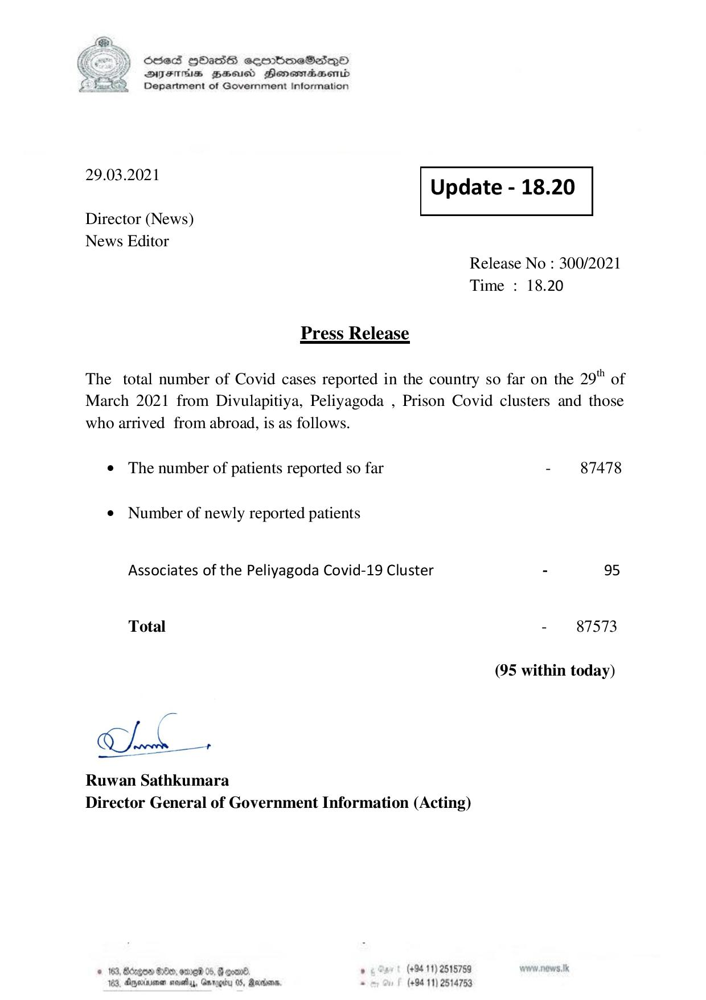

# Press Release - 2021.03.29 
Key: a1f0218c35d415bd9a35415592c15941 

---
```
) ScdeS HOadS cermbmeSsdQo
DVEFIHS HHosd Honomabsenid
Department of Government Information

 

 

29.03.2021 Update - 18.20

 

 

 

Director (News)

News Editor
Release No : 300/2021

Time : 18.20

Press Release

The total number of Covid cases reported in the country so far on the 29" of
March 2021 from Divulapitiya, Peliyagoda , Prison Covid clusters and those

who arrived from abroad, is as follows.

e The number of patients reported so far - 87478

¢ Number of newly reported patients
Associates of the Peliyagoda Covid-19 Cluster - 95
Total - 87573
(95 within today)

Mok x

Ruwan Sathkumara
Director General of Government Information (Acting)

(+94 11) 2515789
(+94 11) 2514753

 
 

2 HOO, omre 05, G goan6,
a nest, Gn

    

```
