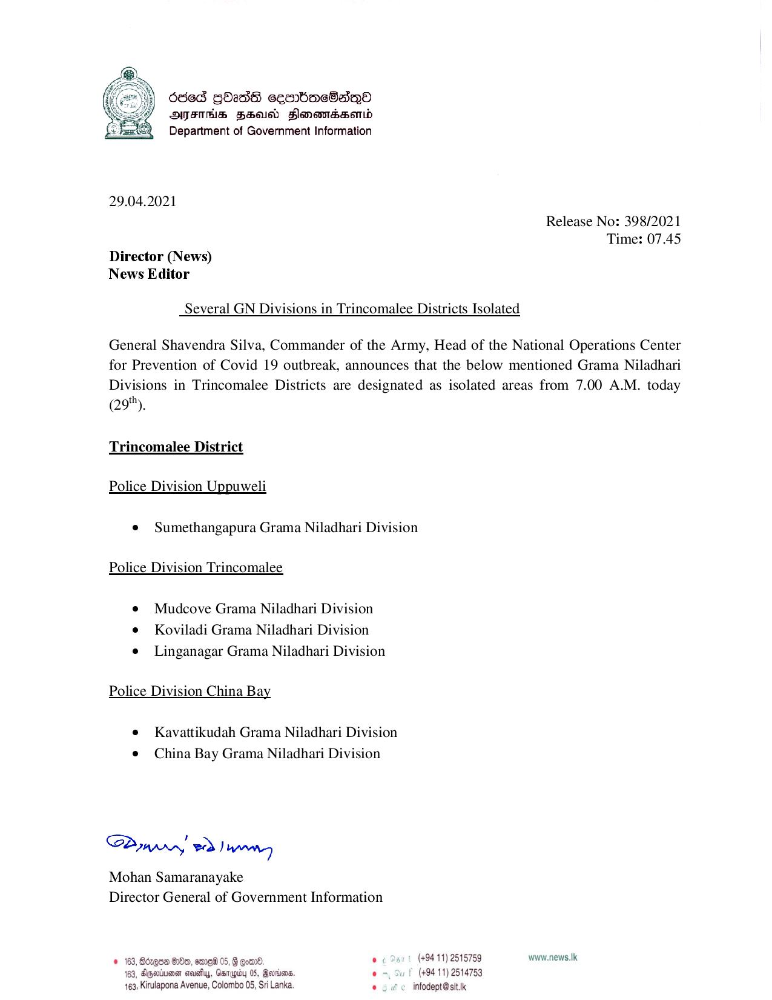

# Press Release - 2021.04.29 -Several GN Divisions in Trincomalee Districts Isolated 
Key: a23d9aff0e38fed5fb6c5c6a21c0bfa7 

---
```
Oded gbed& ceenbmeSasdeQO
AIFS FHA Slonewidssonid
Department of Government Information

 

29.04.2021

Release No: 398/2021

Director (News)
News Editor

Several GN Divisions in Trincomalee Districts Isolated

 

Time: 07.45

General Shavendra Silva, Commander of the Army, Head of the National Operations Center
for Prevention of Covid 19 outbreak, announces that the below mentioned Grama Niladhari
Divisions in Trincomalee Districts are designated as isolated areas from 7.00 A.M. today

(29").
Trincomalee District

Police Division Uppuweli

¢ Sumethangapura Grama Niladhari Division
Police Division Trincomalee

¢ Mudcove Grama Niladhari Division

¢ Koviladi Grama Niladhari Division

e Linganagar Grama Niladhari Division
Police Division China Bay

e Kavattikudah Grama Niladhari Division
¢ China Bay Grama Niladhari Division

SPomw eo a)

Mohan Samaranayake
Director General of Government Information

# 163, Bdzgoa G80, emef 05, G @om®. o¢ (+94 11) 2515759 www.news.Ik
163, Aegsvituenen creusfuy, Ganapidy 05, Bevsiena. en (+94 11) 2514753
4163, Kirulapona Avenue, Colombo 05, Sri Lanka. © fe infodept@ stt.k

```
