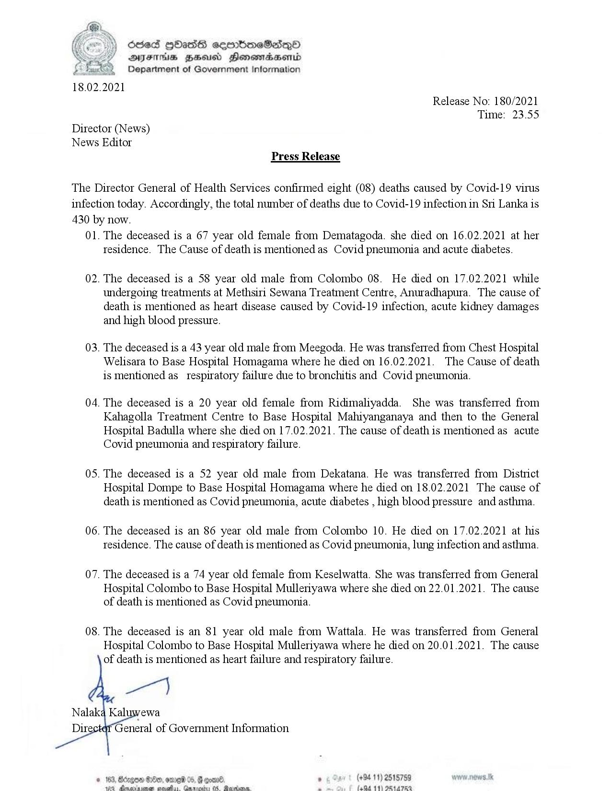

# Press Release - 2021.02.18 - Covid 19 infection deaths 
Key: a38ce01d2147328075f228eed52dcc52 

---
```
(Ce) Sed QHOadss ceenbmneSadeQO
AIFS HH Honemasenid
Department of Government Information

 

 

18.02.2021
Release No: 180/2021
Time: 23.55
Director (News)
News Editor
Press Release

The Director General of Health Services confirmed eight (08) deaths caused by Covid-19 virus
infection today. Accordingly, the total number of deaths due to Covid-19 infection in Sri Lanka is
430 by now.

01. The deceased is a 67 year old female from Dematagoda. she died on 16.02.2021 at her
tesidence. The Cause of death is mentioned as Covid pneumonia and acute diabetes.

02. The deceased is a 58 year old male from Colombo 08. He died on 17.02.2021 while
undergoing treatments at Methsiri Sewana Treatment Centre, Anuradhapura. The cause of
death is mentioned as heart disease caused by Covid-19 infection, acute kidney damages
and high blood pressure.

03. The deceased is a 43 year old male from Meegoda. He was transferred from Chest Hospital
Welisara to Base Hospital Homagama where he died on 16.02.2021. The Cause of death
is mentioned as_ respiratory failure due to bronchitis and Covid pneumonia.

04. The deceased is a 20 year old female from Ridimaliyadda. She was transferred from
Kahagolla Treatment Centre to Base Hospital Mahiyanganaya and then to the General
Hospital Badulla where she died on 17.02.2021. The cause of death is mentioned as acute
Covid pneumonia and respiratory failure.

05. The deceased is a 52 year old male from Dekatana. He was transferred from District
Hospital Dompe to Base Hospital Homagama where he died on 18.02.2021 The cause of
death is mentioned as Covid pneumonia, acute diabetes , high blood pressure and asthma.

06. The deceased is an 86 year old male from Colombo 10. He died on 17.02.2021 at his
tesidence. The cause of death is mentioned as Covid pneumonia, lung infection and asthma.

07. The deceased is a 74 year old female from Keselwatta. She was transferred from General
Hospital Colombo to Base Hospital Mulleriyawa where she died on 22.01.2021. The cause
of death is mentioned as Covid pneumonia.

08. The deceased is an 81 year old male from Wattala. He was transferred from General
Hospital Colombo to Base Hospital Mulleriyawa where he died on 20.01.2021. The cause
of death is mentioned as heart failure and respiratory failure.

  

° (+94 11) 2515759
(404 11) PR44 782

```
