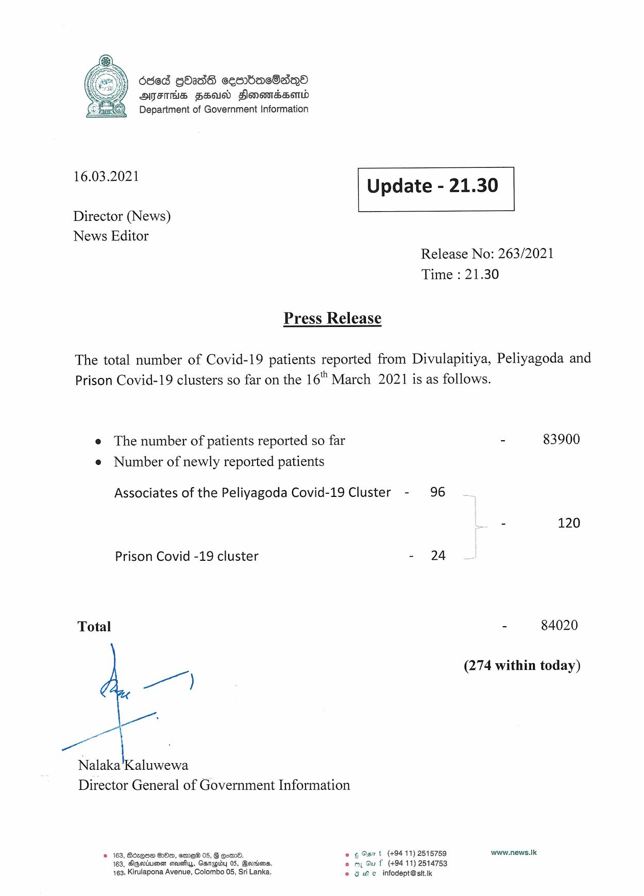

# Press Release - 2021.03.16 
Key: a3d7ba8c6d766be7416b4c60e7bd4a03 

---
```
6868 GOadG cemrbacOsdqQoO
AMES FSU Slonomadssomd
Department of Government Information

 

 

16.03.2021 Update - 21.30

 

 

 

Director (News)

News Editor
Release No: 263/2021

Time : 21.30

Press Release

The total number of Covid-19 patients reported from Divulapitiya, Peliyagoda and
Prison Covid-19 clusters so far on the 16" March 2021 is as follows.

e The number of patients reported so far * 83900
e Number of newly reported patients

Associates of the Peliyagoda Covid-19 Cluster - 96

= 120

Prison Covid -19 cluster - 24

Total - 84020

(274 within today)

|

Nalaka'Kaluwewa
Director General of Government Information

© 163, Sdz@os HOo, emme®™ 05, G Eom. © ¢ Oar t (+94 11) 2515759 www.news.|k
163, Algerian sash, Ganaidy 05, Bortims. eo my Gu f (+94 11) 2514753
163, Kirulapona Avenue, Colombo 05, Sri Lanka. © 8 We infodept@sitik

```
