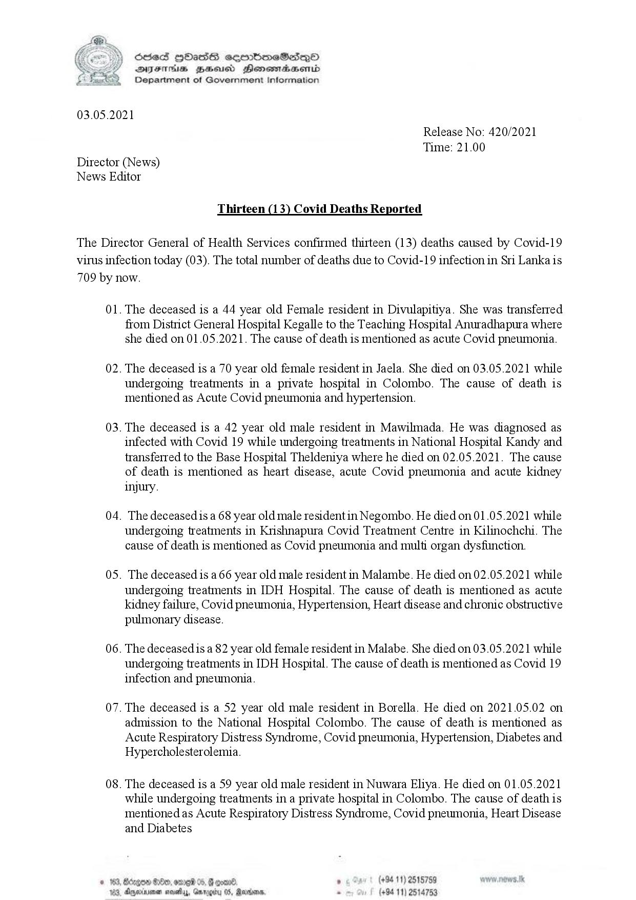

# Press Release - 2021.05.03 - Covid 19 infection deaths 
Key: a407defb70444c1ac111ccd1cde39b3c 

---
```
 

SOeS HOHasS semmbmeScs—oO
DIF Bud Henemadasend
Department of Government Information

03.05.2021

Release No: 420/2021
Time: 21.00

Director (News)
News Editor

Thirteen (13) Covid Deaths Reported

The Director General of Health Services confirmed thirteen (13) deaths caused by Covid-19
virus infection today (03). The total number of deaths due to Covid-19 infection in Sri Lanka is
709 by now.

Ol.

02.

03.

04.

0S.

06.

07.

08.

  

The deceased is a 44 year old Female resident in Divulapitiya. She was transferred
from District General Hospital Kegalle to the Teaching Hospital Anuradhapura where
she died on 01.05.2021. The cause of death is mentioned as acute Covid pneumonia.

The deceased is a 70 year old female resident in Jaela. She died on 03.05.2021 while
undergoing treatments in a private hospital in Colombo. The cause of death is
mentioned as Acute Covid pneumonia and hypertension.

The deceased is a 42 year old male resident in Mawilmada. He was diagnosed as
infected with Covid 19 while undergoing treatments in National Hospital Kandy and
transferred to the Base Hospital Theldeniya where he died on 02.05.2021. The cause
of death is mentioned as heart disease, acute Covid pneumonia and acute kidney

injury.

The deceased is a 68 year old male resident in Negombo. He died on 01.05.2021 while
undergoing treatments in Krishnapura Covid Treatment Centre in Kilinochchi. The
cause of death is mentioned as Covid pneumonia and multi organ dysfunction.

The deceased is a 66 year old male resident in Malambe. He died on 02.05.2021 while
undergoing treatments in IDH Hospital. The cause of death is mentioned as acute
kidney failure, Covid pneumonia, Hypertension, Heart disease and chronic obstructive
pulmonary disease.

The deceased is a 82 year old female resident in Malabe. She died on 03.05.2021 while
undergoing treatments in IDH Hospital. The cause of death is mentioned as Covid 19
infection and pneumonia.

The deceased is a 52 year old male resident in Borella. He died on 2021.05.02 on
admission to the National Hospital Colombo. The cause of death is mentioned as
Acute Respiratory Distress Syndrome, Covid pneumonia, Hypertension, Diabetes and
Hypercholesterolemia.

The deceased is a 59 year old male resident in Nuwara Eliya. He died on 01.05.2021
while undergoing treatments in a private hospital in Colombo. The cause of death is
mentioned as Acute Respiratory Distress Syndrome, Covid pneumonia, Heart Disease
and Diabetes

16 05, @ goan® ° +94 11) 2515789
Garou 05, Rares. - (+94 11) 2514753

```
