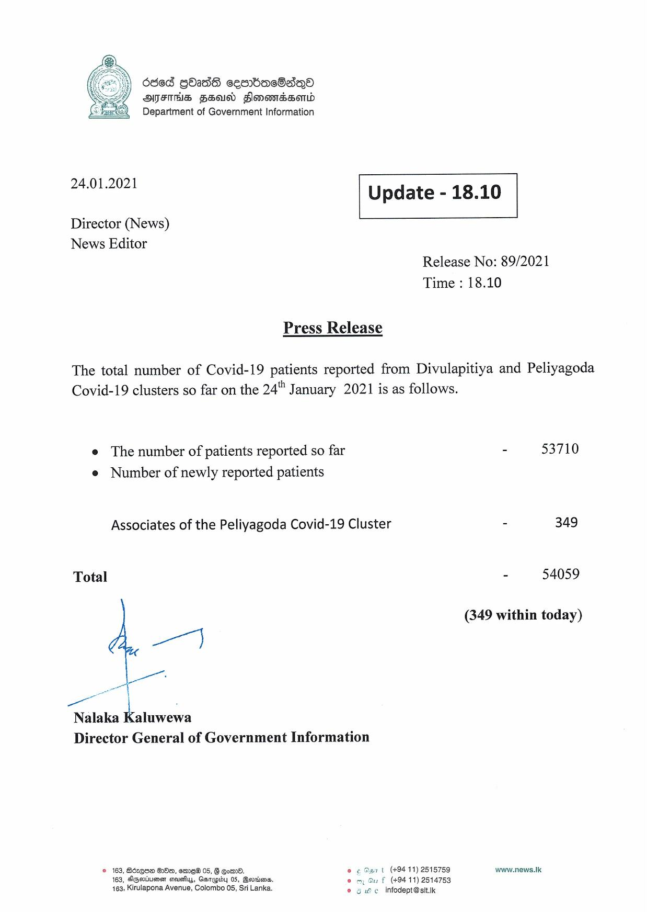

# Press Release - 2021.01.24 
Key: a50adeb3672cc1db722112d5451b0e09 

---
```
dded GOIdS cem=mbacO8a®
SFIS FEA Sonomdsomd
Department of Government Information

 

 

24.01.2021

 

Update - 18.10

 

 

Director (News)
News Editor

Release No: 89/2021
Time : 18.10

Press Release

The total number of Covid-19 patients reported from Divulapitiya and Peliyagoda

Covid-19 clusters so far on the 24" January 2021 is as follows.

e The number of patients reported so far
e Number of newly reported patients

Associates of the Peliyagoda Covid-19 Cluster

Total
ae : k
Nalaka Kaluwewa

Director General of Government Information

© 163, Bdrqse OOo, eeme® 05, § @omm0. @ ¢ O57 t (+9411) 2515759
163, DGeviuensn cious, Garagidy 05, Gevnisens, om, Gu f (49411) 2514753
463, Kirulapona Avenue, Colombo 05, Sri Lanka. © u He infodept@stt.ik

 

- 53710

= 349

- 54059

(349 within today)

www.news.Ik

```
