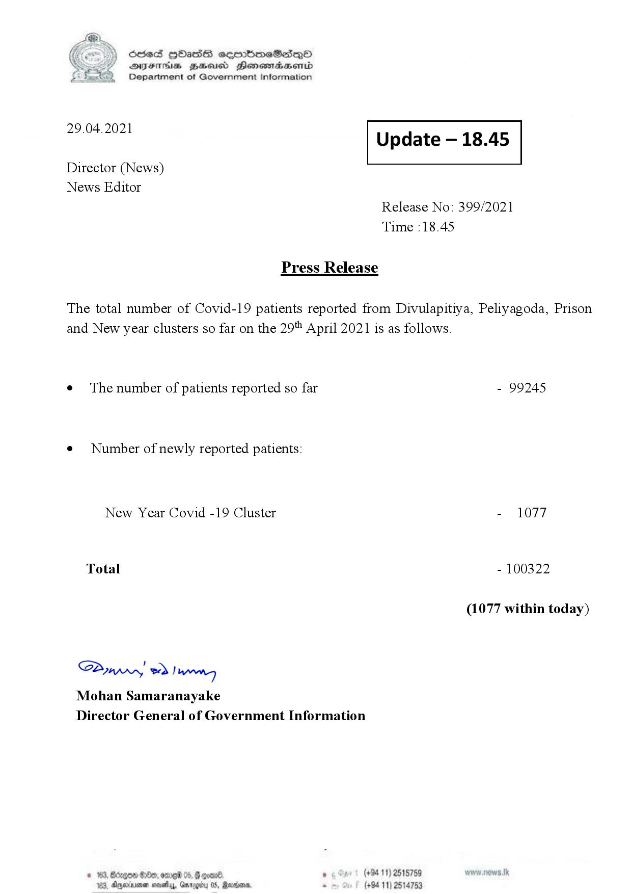

# Press Release - 2021.04.29 
Key: a53da723c3abe9923e22dfe8d8233e47 

---
```
S) ScseS HOasdS cerrbmeSdQo
SVsThis geod Henssnadasombd
Department of Government Information

 

 

29.04.2021 Update — 18.45

 

 

 

Director (News)

News Editor
Release No: 399/2021
Time :18.45

Press Release
The total number of Covid-19 patients reported from Divulapitiya, Peliyagoda, Prison
and New year clusters so far on the 29" April 2021 is as follows.

e The number of patients reported so far - 99245

¢ Number of newly reported patients:

New Year Covid -19 Cluster - 1077
Total - 100322
(1077 within today)

Sw 2) wn
Mohan Samaranayake
Director General of Government Information

© 163, Birgoe $80, omre 05, @ goan®. ° (+94.11) 2515759
183, Dernier mevetlys, Gary Rade. s (+94 11) 2514753

 

```
