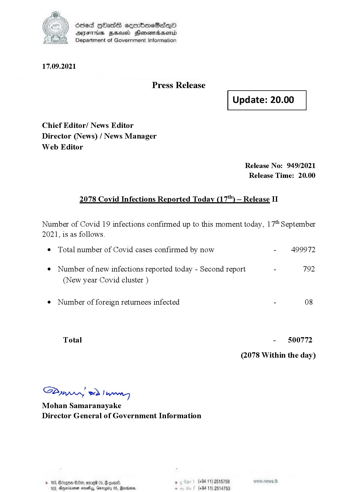

# Press Release - 2021.09.17 - Covid 19 Infection Report 
Key: a5774d9466419ca1d10ec48947facaba 

---
```
dosed GOass eemmbmeSadepO
DFS BHU Honswnradasentd
Department of Government Information

 
 

17.09.2021

Press Release

Chief Editor/ News Editor
Director (News) / News Manager
Web Editor

 

 

Update: 20.00

 

 

Release No: 949/2021
Release Time: 20.00

2078 Covid Infections Reported Today (17) — Release II

Number of Covid 19 infections confirmed up to this moment today, 17" September

2021, is as follows.

¢ Total number of Covid cases confirmed by now

¢ Number of new infections reported today - Second report

(New year Covid cluster )

¢ Number of foreign returnees infected

Total

SPynprn wd Jaren
Mohan Samaranayake
Director General of Government Information

3, Bdzgon Oe, ome 05,
Aryedinionen seve, Garaget

   

, (+94 11) 2515759
(+94 11) 2514753

- 499972

792

- 500772
(2078 Within the day)

```
