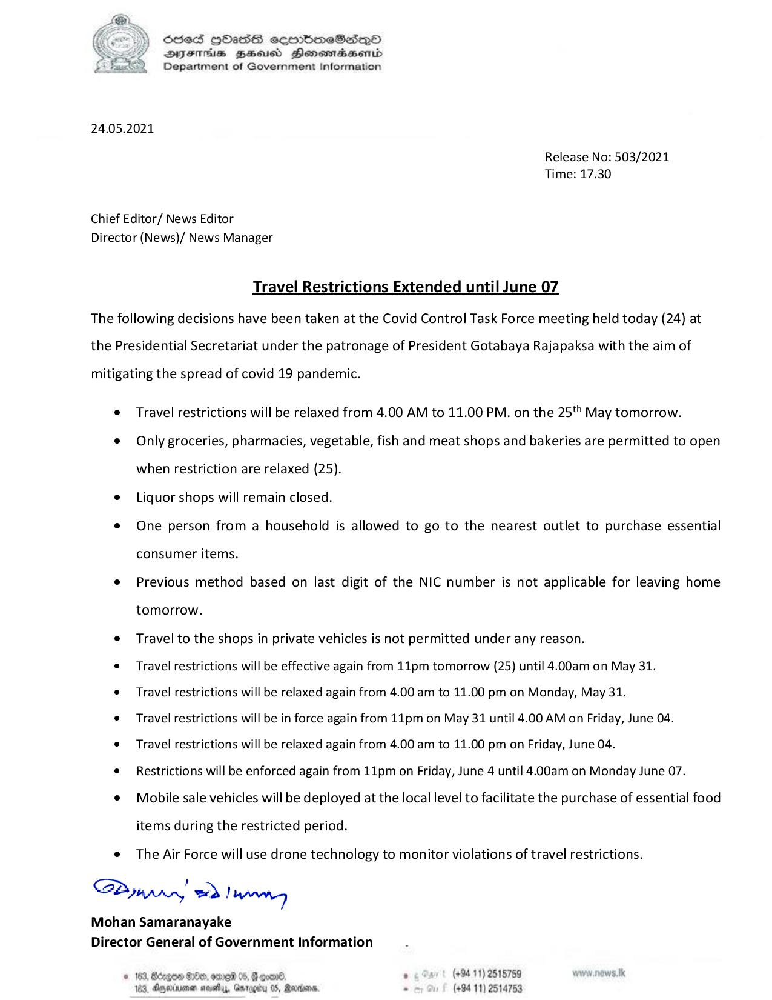

# Press Release - 2021.05.24 - Travel Restrictions Extended until June 07 
Key: a58319e87d42aee974f17e827642af16 

---
```
Sed HOHasS semmimeSies—pO
DYSTHUS BHU Henesresend
Department of Government Information

 

24.05.2021

Release No: 503/2021
Time: 17.30

Chief Editor/ News Editor
Director (News)/ News Manager

Travel Restrictions Extended until June 07
The following decisions have been taken at the Covid Control Task Force meeting held today (24) at
the Presidential Secretariat under the patronage of President Gotabaya Rajapaksa with the aim of

mitigating the spread of covid 19 pandemic.

e Travel restrictions will be relaxed from 4.00 AM to 11.00 PM. on the 25‘ May tomorrow.

e Only groceries, pharmacies, vegetable, fish and meat shops and bakeries are permitted to open
when restriction are relaxed (25).

e Liquor shops will remain closed.

® One person from a household is allowed to go to the nearest outlet to purchase essential
consumer items.

e Previous method based on last digit of the NIC number is not applicable for leaving home
tomorrow.

e Travel to the shops in private vehicles is not permitted under any reason.

¢ Travel restrictions will be effective again from 11pm tomorrow (25) until 4.00am on May 31.

e Travel restrictions will be relaxed again from 4.00 am to 11.00 pm on Monday, May 31.

e Travel restrictions will be in force again from 11pm on May 31 until 4.00 AM on Friday, June 04.

¢ Travel restrictions will be relaxed again from 4.00 am to 11.00 pm on Friday, June 04.

¢ Restrictions will be enforced again from 11pm on Friday, June 4 until 4.00am on Monday June 07.

e¢ Mobile sale vehicles will be deployed at the local level to facilitate the purchase of essential food
items during the restricted period.

e = The Air Force will use drone technology to monitor violations of travel restrictions.

!
S2ynprr, eo beaten
Mohan Samaranayake
Director General of Government Information

. (+94 11) 2515789 ows. Ik
(+94 11) 2514753

   

© 163, Birgon He, omed 06
183. Ayernimer sodas, Gang

```
