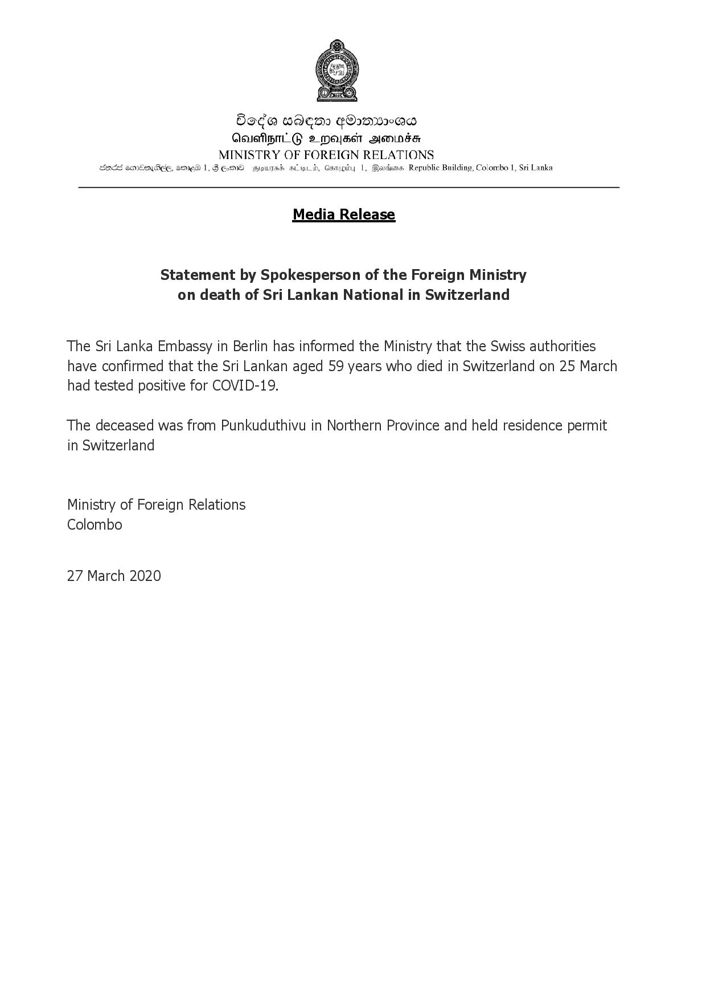

# 27.03.2020 - Statement by Spokesperson of the Foreign Ministry on death of Sri Lankan National in Switzerland 
Key: a5a1160bfad0df063309628bafbb931e 

---
```
 

Doda wAEmo FOs~UV2°a
Aeuehem GO 2 mMajsct soning
MINISTRY OF FOREIGN RELATIONS

SOEs CMEMNGEEE, MD 1,F EMD wrowgH seb, Canegiy 1, Bavixna Republic Building, Colombo 1, Sri Lanka

 

Media Release

Statement by Spokesperson of the Foreign Ministry
on death of Sri Lankan National in Switzerland

The Sri Lanka Embassy in Berlin has informed the Ministry that the Swiss authorities
have confirmed that the Sri Lankan aged 59 years who died in Switzerland on 25 March
had tested positive for COVID-19.

The deceased was from Punkuduthivu in Northern Province and held residence permit
in Switzerland

Ministry of Foreign Relations
Colombo

27 March 2020

```
