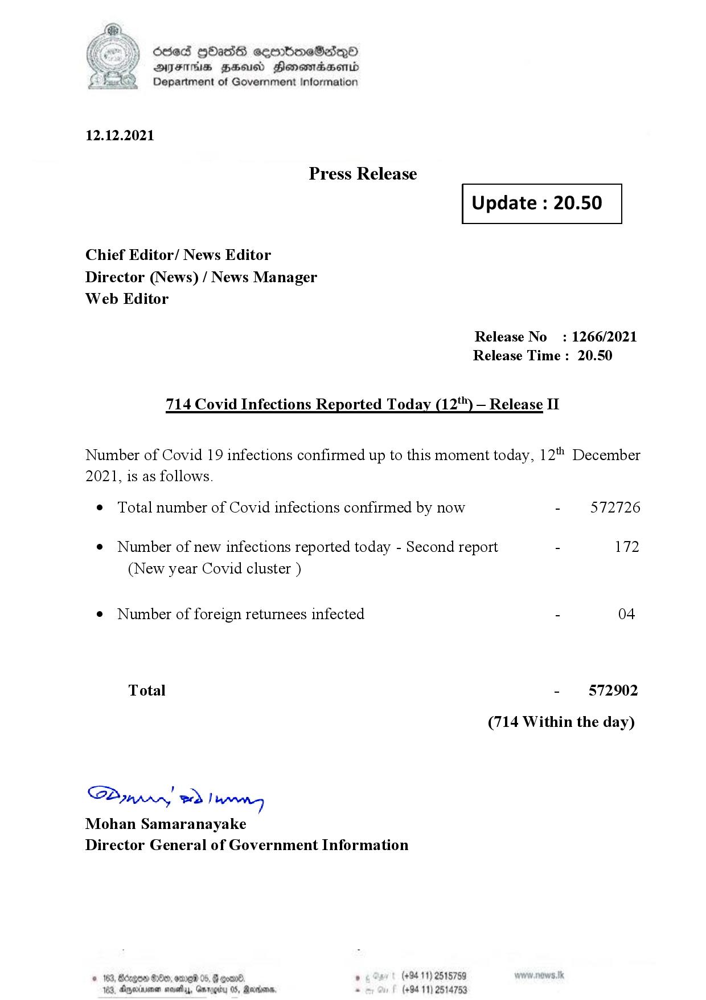

# Press Release - 2021.12.12 - Covid 19 Infection Report 
Key: a5c886329cc4745f69f6ab24e7c6d613 

---
```
dosed GOass eemmbmeSadepO
DFS BHU Honswnradasentd
Department of Government Information

 

 

12.12.2021

Press Release

 

Update : 20.50

 

 

 

Chief Editor/ News Editor
Director (News) / News Manager
Web Editor

Release No: 1266/2021
Release Time : 20.50

714 Covid Infections Reported Today (12'") — Release II

Number of Covid 19 infections confirmed up to this moment today, 12" December
2021, is as follows.

¢ Total number of Covid infections confirmed by now - 572726

¢ Number of new infections reported today - Second report - 172
(New year Covid cluster )

¢ Number of foreign returnees infected - 04
Total - 572902
(714 Within the day)

SP nprrn wd Ianwng
Mohan Samaranayake
Director General of Government Information

(+9411) 2515759
(+84 11) 2514753

© 163, Bdegon 880, ome 06,
163, Aoyerinienen mostly, Gn rege

 

```
