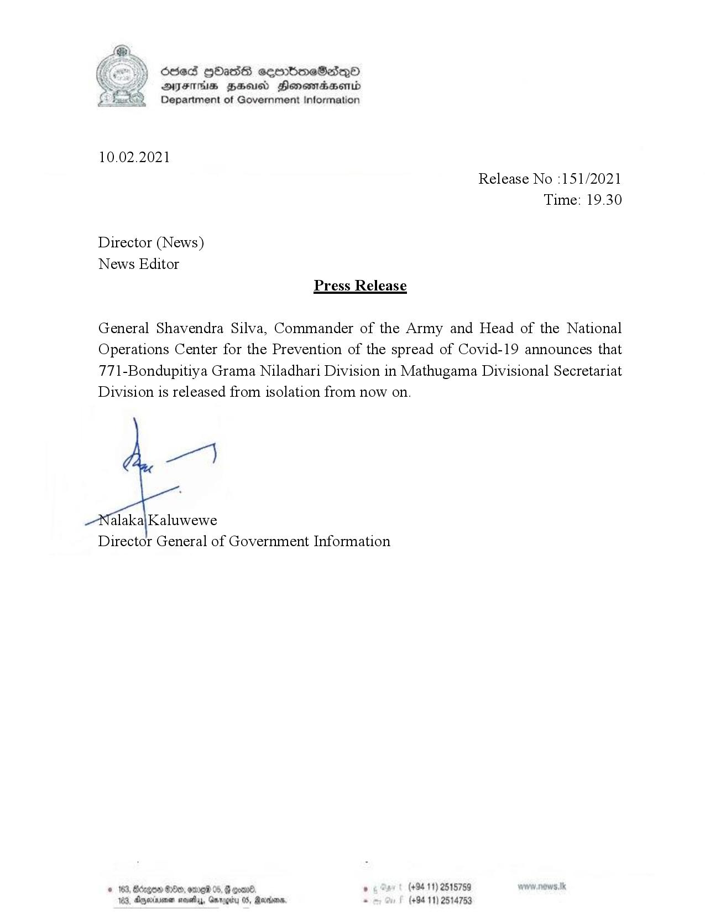

# Press Release - 2021.02.10 - Released from Isolation 
Key: a5e6041b9cfd82f84f893b420bbba377 

---
```
osed gbass sembmeSasqQoO
AFIS BHU Honsmasenid
Department of Government Information

 

10.02.2021
Release No :151/2021
Time: 19.30

Director (News)
News Editor
Press Release

General Shavendra Silva, Commander of the Army and Head of the National
Operations Center for the Prevention of the spread of Covid-19 announces that
77\-Bondupitiya Grama Niladhari Division in Mathugama Divisional Secretariat
Division is released from isolation from now on.

wen)

alaka\|Kaluwewe
Director General of Government Information

© 163, Bdagon 8:80, ome 05, G goane , (+94 11) 2515759
103, Agernene say, Garogiru 05, Ravana, - (+94 11) 2514753

```
