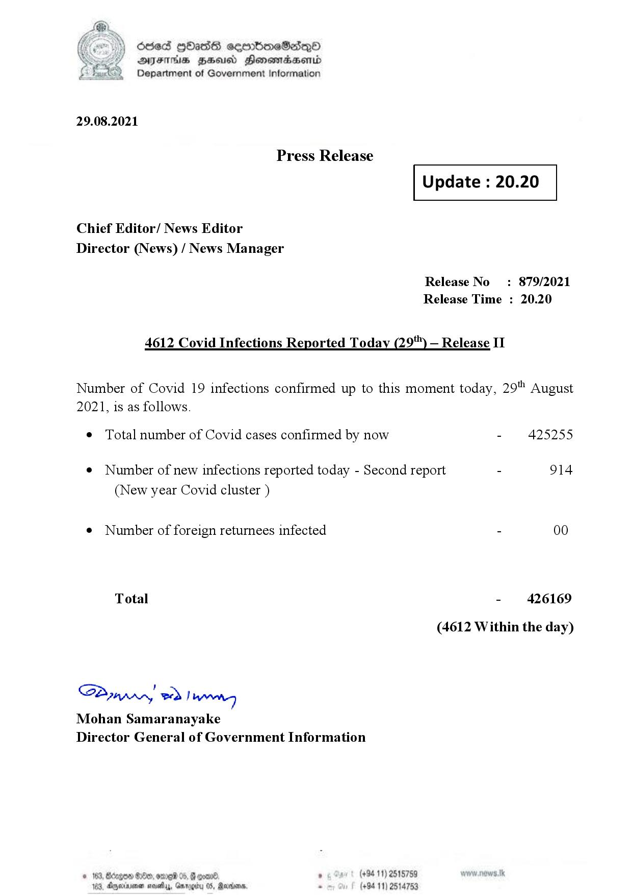

# Press Release - 2021.08.29  - Covid 19 Infection Report 
Key: a6bcb27a6b6909b6183b5b4c65f8435d 

---
```
dosed GOass eemmbmeSadepO
DFS BHU Honswnradasentd
Department of Government Information

 

 

29.08.2021

Press Release

Chief Editor/ News Editor
Director (News) / News Manager

4612 Covid Infections Reported Today (29") — Release II

 

 

Update : 20.20

 

 

Release No

: 879/2021

Release Time : 20.20

Number of Covid 19 infections confirmed up to this moment today, 29" August

2021, is as follows.

¢ Total number of Covid cases confirmed by now

¢ Number of new infections reported today - Second report -

(New year Covid cluster )

¢ Number of foreign returnees infected

Total

SPynprn wd Ing
Mohan Samaranayake
Director General of Government Information

© 163, Bicegeen Be, ome 05, @
103, Dnerisemen saves, aro

 

. (+94 11) 2515759
(+94 11) 2514753

425255

914

00

426169

(4612 Within the day)

```
