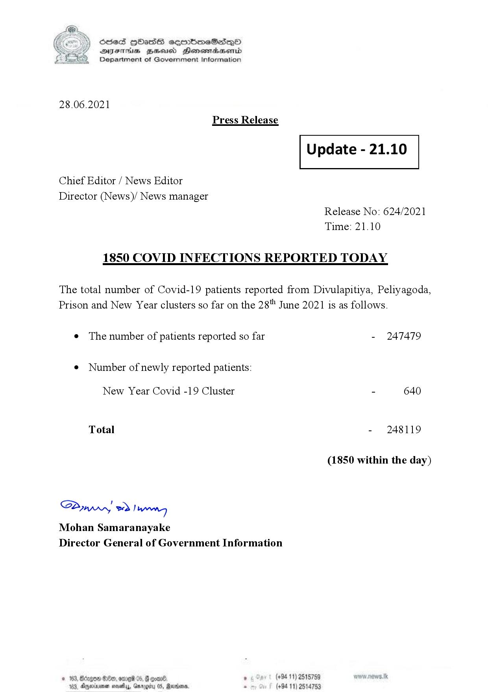

# Press Release - 2021.06.28 - Covid 19 infection report 
Key: a7371f0f6d7fe7ea0e98bcf747c80285 

---
```
(6 S) ScseS HOasdS cerrbmeSdQo
DFTs BHEosd Henewtaeasernid
Department of Government Information

 

28.06.2021
Press Release

Chief Editor / News Editor
Director (News)/ News manager

 

 

Update - 21.10

 

 

Release No: 624/2021
Time: 21.10

1850 COVID INFECTIONS REPORTED TODAY

The total number of Covid-19 patients reported from Divulapitiya, Peliyagoda,
Prison and New Year clusters so far on the 28" June 2021 is as follows.

e The number of patients reported so far

¢ Number of newly reported patients:

New Year Covid -19 Cluster

Total

Saw 2) won,
Mohan Samaranayake
Director General of Government Information

© 163, ong

 

- 247479

- 640

- 248119

(1850 within the day)

00, ome 05, § qoar® , (+94 11) 2515759

103, Ageinvemen wos, Garg 05, Randers. . (+94 11) 2514753

```
