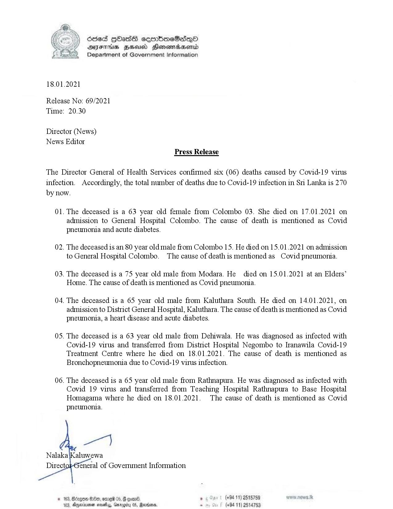

# Press Release - 2021.01.18 - 06 Covid 19 Infection deaths have been reported,total  number of deaths rises to 270 
Key: a8184c144ff573f36f542f9cadcd6834 

---
```
18.01

 

6sed GOHasG semmbmeSadqQo0
DAJFHS HHA Honemtradaserntd
Department of Government Information

.2021

Release No: 69/2021

Time:

20.30

Director (News)
News Editor

Press Release

The Director General of Health Services confirmed six (06) deaths caused by Covid-19 virus
infection. Accordingly, the total number of deaths due to Covid-19 infection in Sri Lanka is 270
by now.

01.

02.

03.

04.

05.

06.

 

The deceased is a 63 year old female from Colombo 03. She died on 17.01.2021 on
admission to General Hospital Colombo. The cause of death is mentioned as Covid
pneumonia and acute diabetes.

The deceased is an 80 year old male from Colombo 15. He died on 15.01.2021 on admission
to General Hospital Colombo. The cause of death is mentioned as Covid pneumonia.

The deceased is a 75 year old male from Modara. He died on 15.01.2021 at an Elders’
Home. The cause of death is mentioned as Covid pneumonia.

The deceased is a 65 year old male from Kaluthara South. He died on 14.01.2021, on
admission to District General Hospital, Kaluthara. The cause of death is mentioned as Covid
pneumonia, a heart disease and acute diabetes.

The deceased is a 63 year old male from Dehiwala. He was diagnosed as infected with
Covid-19 virus and transferred from District Hospital Negombo to Iranawila Covid-19
Treatment Centre where he died on 18.01.2021. The cause of death is mentioned as
Bronchopneumonia due to Covid-19 virus infection.

The deceased is a 65 year old male from Rathnapura. He was diagnosed as infected with
Covid 19 virus and transferred from Teaching Hospital Rathnapura to Base Hospital
Homagama where he died on 18.01.2021. The cause of death is mentioned as Covid
pneumonia.

. (+94 11) 2515759
(+94 11) 2514753

```
