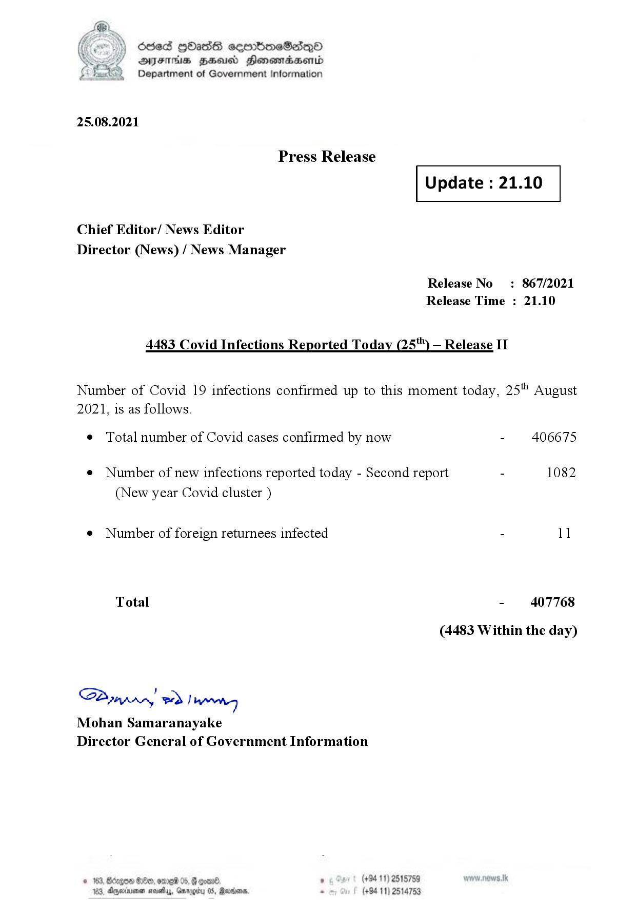

# Press Release - 2021.08.25 - Covid 19 Infection Report 
Key: a9047975fccc663abd337628a83c91a2 

---
```
dosed GOass eemmbmeSadepO
DFS BHU Honswnradasentd
Department of Government Information

 

 

25.08.2021

Press Release

Chief Editor/ News Editor
Director (News) / News Manager

4483 Covid Infections Reported Today (25") — Release II

 

 

Update : 21.10

 

 

Release No

: 867/2021

Release Time : 21.10

Number of Covid 19 infections confirmed up to this moment today, 25" August

2021, is as follows.

¢ Total number of Covid cases confirmed by now

¢ Number of new infections reported today - Second report -

(New year Covid cluster )

¢ Number of foreign returnees infected

Total

SPynprn wd Ing
Mohan Samaranayake
Director General of Government Information

© 163, Bicegeen Be, ome 05, @
103, Dnerisemen saves, aro

 

. (+94 11) 2515759
(+94 11) 2514753

406675

1082

11

407768

(4483 Within the day)

```
