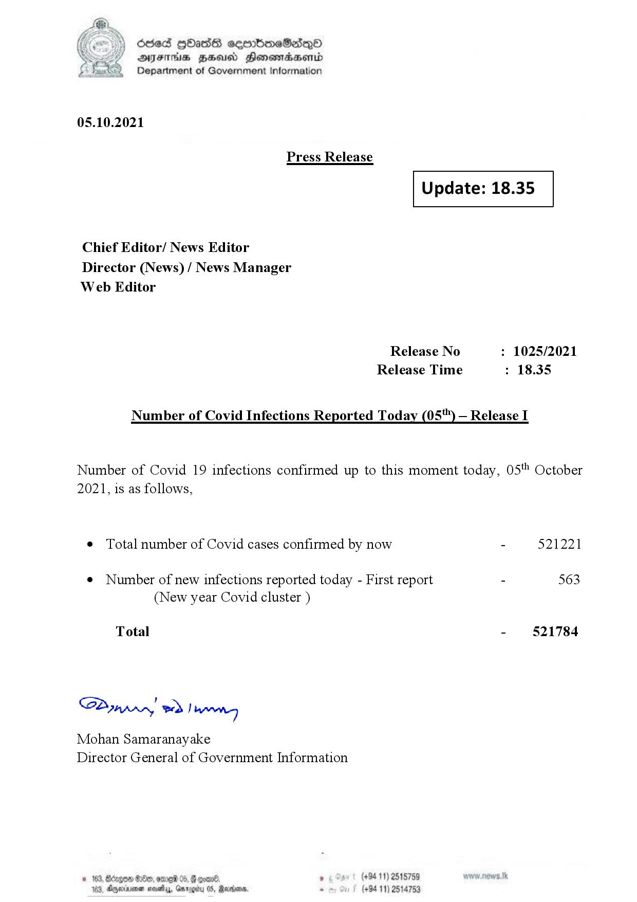

# Press Release  - 2021.10.05 
Key: a9f576d2d6a3e6edc9a8dde20ab21bb7 

---
```
(oe) Sed QOass cerrbroeSadqQo
DFS HHS Honsmnadaerntd
Department of Government Information

 

05.10.2021

Press Release

 

Update: 18.35

 

 

 

Chief Editor/ News Editor
Director (News) / News Manager
Web Editor

Release No : 1025/2021
Release Time : 18.35

Number of Covid Infections Reported Today (05'") — Release I

Number of Covid 19 infections confirmed up to this moment today, 05" October
2021, is as follows,

¢ Total number of Covid cases confirmed by now - 521221

¢ Number of new infections reported today - First report - 563
(New year Covid cluster )

-  §21784

Total

Sa mprn! wd! wong

Mohan Samaranayake
Director General of Government Information

(+94 11) 2515759
(+94 11) 2514753

 

```
