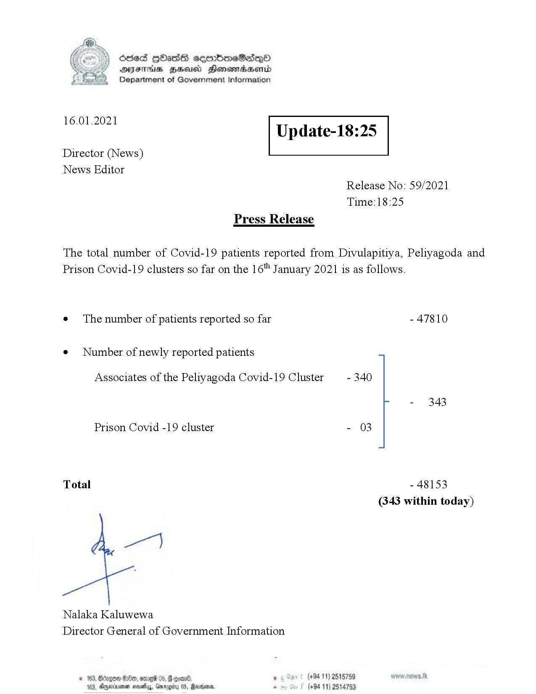

# Press Release - 2021.01.16 
Key: aae64abcf9e103f2d8c9947f6d89093d 

---
```
Ssed HbasG sembmeSadqo
DAIS BHU Honomasentd
Department of Government Information

 

 

16.01.2021

Update-18:25

 

 

 

Director (News)
News Editor
Release No: 59/2021
Time:18:25
Press Release

The total number of Covid-19 patients reported from Divulapitiya, Peliyagoda and
Prison Covid-19 clusters so far on the 16" January 2021 is as follows.

e¢ The number of patients reported so far - 47810

¢ Number of newly reported patients
Associates of the Peliyagoda Covid-19 Cluster - 340
- 343

Prison Covid -19 cluster - 03

Total - 48153
(343 within today)

Nalaka Kaluwewa
Director General of Government Information

© 163, Bécge &0eo, orme® 05, @ con®. 8 (+94 11) 2515759
163, Agexuee neaty, Grrggiy 05, Rares. - (+94 11) 2514753

 

```
